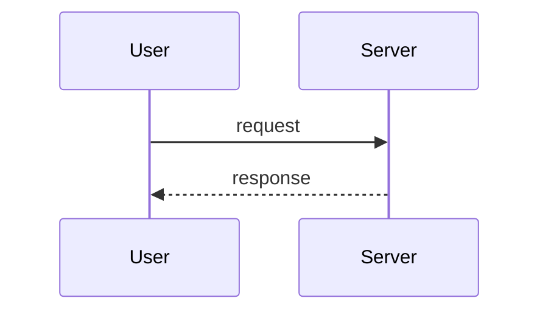

# Coding Style

## Immutability (CRITICAL)

ALWAYS create new objects, NEVER mutate:

```javascript
// WRONG: Mutation
function updateUser(user, name) {
  user.name = name  // MUTATION!
  return user
}

// CORRECT: Immutability
function updateUser(user, name) {
  return {
    ...user,
    name
  }
}
```

## File Organization

MANY SMALL FILES > FEW LARGE FILES:
- High cohesion, low coupling
- 200-400 lines typical, 800 max
- Extract utilities from large components
- Organize by feature/domain, not by type

## Error Handling

ALWAYS handle errors comprehensively:

```typescript
try {
  const result = await riskyOperation()
  return result
} catch (error) {
  console.error('Operation failed:', error)
  throw new Error('Detailed user-friendly message')
}
```

## Input Validation

ALWAYS validate user input:

```typescript
import { z } from 'zod'

const schema = z.object({
  email: z.string().email(),
  age: z.number().int().min(0).max(150)
})

const validated = schema.parse(input)
```

## Python Toolchain

ALWAYS use `uv` for Python dependency management, NEVER pip/poetry/pipenv:

```bash
# WRONG: pip
pip install requests
pip freeze > requirements.txt

# WRONG: poetry
poetry add requests

# CORRECT: uv
uv init                    # new project
uv add requests            # add dependency
uv add --dev pytest        # add dev dependency
uv run python main.py      # run script
uv run pytest              # run tests
uv sync                    # sync dependencies
```

Project setup convention:
```bash
uv init --python 3.11
uv add anthropic python-dotenv rich click
uv add --dev pytest pytest-asyncio
```

## Diagrams (CRITICAL)

ALWAYS use Mermaid for diagrams, NEVER ASCII art:

```
# WRONG: ASCII art
User ----request----> Server

# CORRECT: Mermaid (GitHub native render)

```

Mermaid diagram types:
- `sequenceDiagram` — data flow, API calls, message passing
- `flowchart TD` — architecture, module dependencies, decision trees
- `erDiagram` — database schema, entity relationships
- `stateDiagram-v2` — state machines, lifecycle

## Code Quality Checklist

Before marking work complete:
- [ ] Code is readable and well-named
- [ ] Functions are small (<50 lines)
- [ ] Files are focused (<800 lines)
- [ ] No deep nesting (>4 levels)
- [ ] Proper error handling
- [ ] No console.log statements
- [ ] No hardcoded values
- [ ] No mutation (immutable patterns used)
