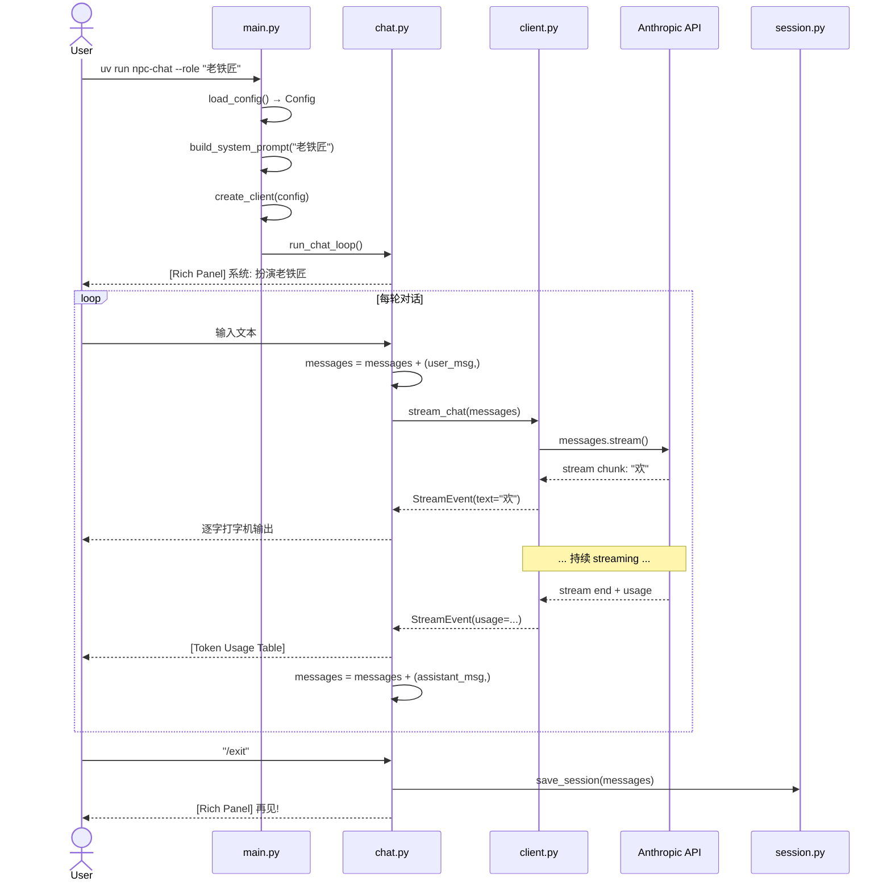

# Implementation Plan: CLI NPC Chat

> Phase 2 学习项目 — LLM API 调用实战
> 目标：理解 Anthropic API 的 Streaming、Multi-turn、Token 计费等核心概念

## Overview

A Python CLI tool that lets users converse with AI-powered NPC characters via the Anthropic Claude API. Built with streaming responses (typewriter effect), rich terminal UI, session persistence, and strict immutable state management.

**Learning goals:** LLM API calling, streaming, Python CLI tooling, and test-driven development.

---

## Project Structure

```
/Users/caibiliang/code/npc-chat/
├── .env.example
├── .gitignore
├── pyproject.toml
├── src/
│   ├── __init__.py
│   ├── main.py           # CLI entry (click)
│   ├── chat.py           # Chat loop orchestration
│   ├── client.py         # Anthropic API wrapper (streaming)
│   ├── session.py        # Session save/load/clear (JSON)
│   ├── config.py         # Env config loading
│   └── prompts.py        # NPC role templates
└── tests/
    ├── __init__.py
    ├── conftest.py        # Fixtures (mocked client, temp dir, etc.)
    ├── test_client.py
    ├── test_session.py
    ├── test_prompts.py
    ├── test_config.py
    ├── test_chat.py
    └── test_main.py
```

---

## Tech Stack

```bash
uv init --python 3.11
uv add anthropic python-dotenv rich click
uv add --dev pytest pytest-asyncio pytest-cov pytest-mock
```

| Package | Purpose |
|---------|---------|
| anthropic | Anthropic Claude API SDK |
| python-dotenv | .env 配置加载 |
| rich | 终端美化：Panel / Markdown / Table / Live |
| click | CLI 参数解析和命令组织 |
| pytest | 测试框架 |

**永远不引入 LangChain 或任何 AI 框架。**

---

## Data Flow



---

## Module-by-Module Design

### 1. config.py — 环境配置

```python
@dataclass(frozen=True)
class Config:
    api_key: str
    model: str
    max_tokens: int
    session_dir: str


def load_config(env_path: str | None = None) -> Config:
    """Load and validate configuration from .env file.

    Raises:
        ConfigError: If ANTHROPIC_API_KEY is missing or empty.
    Returns:
        Immutable Config instance.
    """
```

- Config 是 frozen dataclass，创建后不可修改
- API key 缺失时抛出 `ConfigError`，不返回 partial config
- 有默认值：model=`claude-sonnet-4-20250514`, max_tokens=1024, session_dir=`./sessions`

### 2. prompts.py — NPC 角色模板

```python
ROLE_TEMPLATES: Final[dict[str, str]] = {
    "老铁匠": "你是一位经验丰富的老铁匠，名叫张铁柱。...",
    "酒馆老板": "你是一位精明圆滑的酒馆老板，名叫王三娘。...",
    "流浪剑客": "你是一位沉默寡言的流浪剑客...",
}

def build_system_prompt(role_name: str) -> str:
    """Build system prompt. Raises ValueError for unknown role."""

def get_available_roles() -> tuple[str, ...]:
    """Return tuple of available role names (immutable)."""
```

- ROLE_TEMPLATES 是模块级常量，初始化后不修改
- 返回值类型用 tuple，强制不可变

### 3. session.py — 会话持久化

```python
@dataclass(frozen=True)
class SessionMeta:
    id: str
    role: str
    created_at: str
    updated_at: str

def save_session(
    path: str,
    messages: Sequence[dict],  # 接受 list 或 tuple
    role: str,
    meta: SessionMeta | None = None,
) -> SessionMeta: ...

def load_session(path: str) -> tuple[tuple[dict, ...], SessionMeta]:
    """返回 IMMUTABLE tuple[dict, ...]，不是 list"""

def clear_session(path: str) -> None: ...

def list_sessions(session_dir: str) -> tuple[tuple[str, SessionMeta], ...]: ...
```

JSON 文件格式：
```json
{
    "meta": {
        "id": "20260612_143022_abc123",
        "role": "老铁匠",
        "created_at": "2026-06-12T14:30:22",
        "updated_at": "2026-06-12T15:10:45"
    },
    "messages": [
        {"role": "user", "content": "你好"},
        {"role": "assistant", "content": "欢迎来到我的铁匠铺！"}
    ]
}
```

### 4. client.py — Anthropic API 封装

```python
@dataclass(frozen=True)
class Usage:
    input_tokens: int
    output_tokens: int

    @property
    def total_tokens(self) -> int:
        return self.input_tokens + self.output_tokens

@dataclass(frozen=True)
class StreamEvent:
    text: str | None = None
    usage: Usage | None = None
    error: str | None = None


def create_client(config: Config) -> Anthropic:
    """Create Anthropic client from config."""

def stream_chat(
    client: Anthropic,
    messages: tuple[dict, ...],
    system_prompt: str,
    model: str,
    max_tokens: int,
) -> Generator[StreamEvent, None, None]:
    """Stream chat response. Yields text events, then usage event, or error event."""
```

**核心实现逻辑：**
1. 使用 `client.messages.stream()` 获取流式响应
2. yield 每个 text chunk 作为 `StreamEvent(text=...)`
3. 流结束后从 `stream.get_final_message().usage` 提取 token 信息，yield `StreamEvent(usage=...)`
4. API 异常 catch 后 yield `StreamEvent(error=...)`

### 5. chat.py — 对话循环

```python
def run_chat_loop(
    client: Anthropic,
    config: Config,
    role: str,
    initial_messages: tuple[dict, ...] = (),
) -> None:
    """Run interactive chat loop with typewriter output."""
```

**不可变状态管理（核心模式）：**

```python
messages: tuple[dict, ...] = initial_messages

while True:
    user_input = prompt_user()
    if user_input == "/exit":
        break

    # 每次创建新 tuple，不修改原 tuple
    user_msg = {"role": "user", "content": user_input}
    messages = messages + (user_msg,)

    full_text = ""
    for event in stream_chat(client, messages, system_prompt, ...):
        if event.text:
            typewriter_print(event.text)
            full_text += event.text
        elif event.usage:
            assistant_msg = {"role": "assistant", "content": full_text}
            messages = messages + (assistant_msg,)  # 不可变
            display_token_usage(event.usage)
        elif event.error:
            display_error(event.error)
```

**打字机效果（Rich Live）：**
```python
def _animate_text(console: Console, text: str, title: str) -> None:
    from rich.live import Live
    from rich.panel import Panel
    from rich.text import Text

    displayed = ""
    with Live(console=console, refresh_per_second=30) as live:
        for char in text:
            displayed += char
            live.update(Panel(
                Text(displayed, style="green"),
                title=title,
                border_style="bright_blue",
            ))
            time.sleep(0.015)  # ~60 chars/sec
```

### 6. main.py — CLI 入口

```python
@click.group()
def cli():
    """NPC Chat - Converse with AI-powered characters."""

@cli.command()
@click.option("--role", required=True, help="NPC role name")
@click.option("--model", default=None, help="Override model name")
@click.option("--session", default=None, help="Load existing session file")
def chat(role: str, model: str | None, session: str | None):
    """Start interactive chat with an NPC."""

@cli.group()
def session():
    """Manage chat sessions."""

@session.command("list")
def session_list(): ...

@session.command("load")
@click.argument("session_id")
def session_load(session_id: str): ...

@session.command("clear")
@click.argument("session_id")
def session_clear(session_id: str): ...
```

---

## Error Handling Strategy

| 层级 | 错误类型 | 处理方式 |
|------|---------|---------|
| config.py | `ConfigError` | 立即 raise，main.py 捕获并显示友好提示 |
| prompts.py | `ValueError` | raise，click 显示错误信息 |
| session.py | `SessionError`, `FileNotFoundError` | raise，main.py 捕获显示 |
| client.py | `anthropic.APIError` | yield `StreamEvent(error=...)`，chat.py 决定重试或退出 |
| chat.py | 各种 | Rich red panel 显示，不崩溃 |
| main.py | Top-level 兜底 | Rich 格式化错误，非 0 退出码 |

**API 重试策略（client.py）：**
- `RateLimitError` / `OverloadedError` / `InternalServerError` → 指数退避重试 3 次（1s, 2s, 4s）
- 3 次后仍失败 → yield `StreamEvent(error="...")`

---

## Rich UI 组件映射

| 内容 | Rich 组件 | 样式 |
|------|----------|------|
| 系统消息（角色介绍） | `Panel` + `Text` | bold green |
| 用户消息 | `Panel` + `Text` | bright_white on blue |
| NPC 回复 | `Panel` + `Markdown` | cyan，支持 markdown 渲染 |
| 打字机效果 | `Live` + `Panel` | green text |
| Token 用量 | `Panel` + `Table` | bright_yellow border |
| 错误信息 | `Panel` + `Text` | red text, red border |
| 帮助文本 | `Panel` + `Markdown` | dim style |

---

## TDD 实施顺序

| 序号 | 测试文件 | 被测模块 | 原因 |
|------|---------|---------|------|
| 1 | `test_config.py` | `config.py` | 零依赖，纯数据 |
| 2 | `test_prompts.py` | `prompts.py` | 零依赖，纯字符串 |
| 3 | `test_session.py` | `session.py` | 仅依赖 stdlib JSON |
| 4 | `test_client.py` | `client.py` | 依赖 config，用 mock Anthropic |
| 5 | `test_chat.py` | `chat.py` | 依赖 client + session + prompts |
| 6 | `test_main.py` | `main.py` | 集成测试，用 click CliRunner |

每个模块：**先写测试（RED）→ 写实现（GREEN）→ 重构（IMPROVE）**

---

## 关键测试场景

### test_session.py — 不可变性测试
```python
def test_loaded_messages_immutable(tmp_path):
    messages = ({"role": "user", "content": "hello"},)
    save_session(str(tmp_path / "test.json"), messages, role="test")
    loaded, _ = load_session(str(tmp_path / "test.json"))
    # tuple 没有 append 方法
    with pytest.raises(AttributeError):
        loaded.append({"role": "assistant", "content": "hi"})
```

### test_client.py — mock 模式
```python
@pytest.fixture
def mock_stream():
    mock_stream = MagicMock()
    mock_stream.text_stream = iter(["你好", "旅", "人！"])
    mock_final = MagicMock()
    mock_final.usage = MagicMock(input_tokens=10, output_tokens=3)
    mock_stream.get_final_message.return_value = mock_final
    mock_client = MagicMock(spec=Anthropic)
    mock_client.messages.stream.return_value.__enter__.return_value = mock_stream
    return mock_client

def test_stream_chat_yields_text_and_usage(mock_stream):
    events = list(stream_chat(mock_stream, (), "prompt", "model", 100))
    texts = "".join(e.text for e in events if e.text)
    assert texts == "你好旅人！"
    usage = [e.usage for e in events if e.usage]
    assert len(usage) == 1
    assert usage[0].input_tokens == 10
    assert usage[0].output_tokens == 3
```

---

## 实施时间估算

| 任务 | 依赖 | 预计 |
|------|------|------|
| 1. 项目脚手架（目录, pyproject.toml, .env.example） | 无 | 10 min |
| 2. config.py + test_config.py | 无 | 20 min |
| 3. prompts.py + test_prompts.py | 无 | 20 min |
| 4. session.py + test_session.py | config | 30 min |
| 5. client.py + test_client.py | config | 30 min |
| 6. chat.py + test_chat.py | client, session, prompts, config | 40 min |
| 7. main.py + test_main.py | chat, config | 30 min |
| 8. 手动 E2E 测试（真实 API key） | 全部 | 20 min |
| **总计** | | **~3 小时** |

---

## 成功标准

- [ ] `uv run npc-chat --role "老铁匠"` 启动交互式聊天
- [ ] 逐字打字机效果输出 NPC 回复
- [ ] 每轮对话后显示 Token 用量表
- [ ] `/save`、`/load`、`/clear` 命令可用
- [ ] 会话跨进程持久化（JSON 往返正确）
- [ ] messages 始终是 `tuple[dict, ...]`，零 mutation
- [ ] 未知角色显示清晰的错误提示
- [ ] 缺少 API key 显示 `.env` 配置提示
- [ ] NPC 回复支持 Rich Markdown 渲染
- [ ] `uv run pytest` 通过，覆盖率 ≥ 80%
- [ ] Ctrl+C 优雅退出
