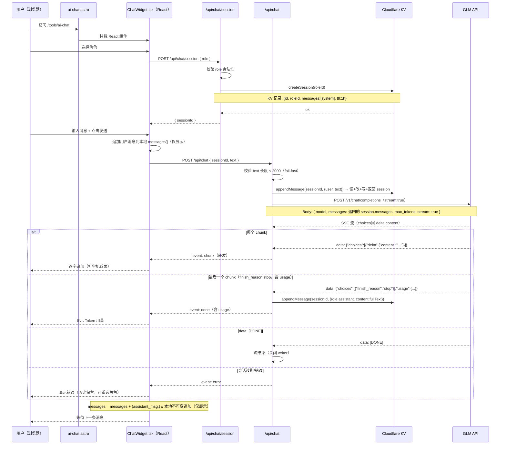

# 实现方案：Web AI NPC 聊天

> Phase 2 Web — 将 AI NPC 聊天集成到现有 Astro 5 网站 my.woshicai.tech
> Phase 1（本次）：核心聊天功能 + 5 个硬编码角色 + 服务端会话管理
> Phase 2（后续）：角色 CRUD（Cloudflare KV 持久化）
> Phase 3（后续）：会话持久化 + 用户登录态

---

## 目录

1. [概述](#概述)
2. [架构与数据流](#架构与数据流)
3. [项目结构](#项目结构)
4. [模块设计](#模块设计)
   - 4.1 [src/lib/roles.ts — NPC 角色定义](#41-srclibrolests--npc-角色定义)
   - 4.2 [src/lib/chat.ts — 共享类型与工具函数](#42-srclibchats----共享类型与工具函数)
   - 4.3 [src/pages/api/chat/index.ts — POST /api/chat 流式聊天](#43-srcpagesapichatindexts----post-apichat-流式聊天)
   - 4.4 [src/lib/session.ts — 会话 KV 管理](#44-srclibsessionts--会话-kv-管理)
   - 4.5 [src/pages/api/chat/session.ts — 建会话端点](#45-srcpagesapichatsessionts--建会话端点)
   - 4.6 [src/components/chat/RoleSelector.tsx — 角色选择](#46-srccomponentschatroleselectortsx--角色选择)
   - 4.7 [src/components/chat/MessageList.tsx — 消息展示](#47-srccomponentschatmessagelisttsx--消息展示)
   - 4.8 [src/components/chat/ChatInput.tsx — 输入框](#48-srccomponentschatchatinputtsx--输入框)
   - 4.9 [src/components/chat/ChatWidget.tsx — 主聊天组件](#49-srccomponentschatChatWidgettsx--主聊天组件)
   - 4.10 [src/pages/tools/ai-chat.astro — 页面外壳](#410-srcpagestoolsai-chatastro----页面外壳)
   - 4.11 [src/pages/tools/index.astro — 更新工具列表](#411-srcpagestoolsindexastro----更新工具列表)
5. [流式传输实现细节](#5-流式传输实现细节)
6. [消息状态的不可变模式](#6-消息状态的不可变模式)
7. [从 GLM SSE 流中统计 Token](#7-从-glm-sse-流中统计-token)
8. [各层错误处理](#8-各层错误处理)
9. [环境配置](#9-环境配置)
10. [TDD 实施顺序](#10-tdd-实施顺序)
11. [5 个默认 NPC 角色](#11-5-个默认-npc-角色)
12. [后续阶段](#12-后续阶段)
    - [Phase 2：角色 CRUD（Cloudflare KV）](#phase-2角色-crudcloudflare-kv)
    - [Phase 3：会话持久化](#phase-3会话持久化)
13. [实施时间线](#13-实施时间线)
14. [实际部署踩坑（Phase 1 上线后追加）](#14-实际部署踩坑phase-1-上线后追加)
    - [14.1 Cloudflare Pages 不自动读 wrangler.toml](#141-cloudflare-pages-不自动读-wranglertoml)
    - [14.2 GLM SSE 流的"空回复"问题（output_tokens > 0 但 textLen = 0）](#142-glm-sse-流的空回复问题output_tokens--0-但-textlen--0)
    - [14.3 Cloudflare Workers 30s CPU 限制](#143-cloudflare-workers-30s-cpu-限制)
    - [14.4 chat-session.ts 改名（与现有 session.ts 冲突）](#144-chat-sessionts-改名与现有-sessionts-冲突)
    - [14.5 SESSIONS KV 是死存储（已清理）](#145-sessions-kv-是死存储已清理)

---

## 概述

在现有 Astro 5 + Cloudflare Workers 网站上添加 AI NPC 聊天页面。用户选择幻想世界 NPC 角色，输入文字，以打字机效果接收 GLM API（OpenAI 兼容协议）的流式回复，每次回复后显示 Token 用量。

**核心设计决策：**

- **LLM 后端用 GLM API（OpenAI 兼容协议）** — `POST /v1/chat/completions`，system prompt 作为 `role: "system"` 消息内嵌在 messages 数组中
- **会话历史由服务端持有（Cloudflare KV）** — 客户端只持有 sessionId，每轮只发送当前用户输入，杜绝伪造历史和注入上下文
- **服务端自动截断上下文** — 保留 system prompt + 最近 20 轮对话（40 条消息），防止超出 context window
- **不引入任何 LLM SDK** — 直接用 `fetch`，零依赖，Cloudflare Workers 兼容
- **React 19 做聊天 UI** — 聊天需要复杂的状态管理（流式文本、不可变消息数组），React 已是项目依赖
- **TypeScript 严格模式** — 全量类型覆盖
- **纯不可变状态管理** — 不引入外部状态库
- **API key 仅限服务端** — 所有 API 调用通过 `/api/chat` 代理，绝不暴露给客户端
- **遵循现有项目规范** — Tailwind CSS、astro-orange 主题色、深色模式、container 布局

---

## 架构与数据流



**信任边界：** 消息历史的唯一真相来源是服务端 KV。客户端的 `messages[]` 降级为纯展示数组，不参与请求构造，无法伪造 `role: "assistant"` 历史或注入额外上下文。system prompt 完全在服务端组装，客户端无权修改。

**客户端与 /api/chat 之间的 SSE 流协议：**

`/api/chat` 端点返回 `Content-Type: text/event-stream` 的 `ReadableStream`。流中发送自定义事件：

```
event: chunk
data: {"type":"chunk","text":"你好"}

event: chunk
data: {"type":"chunk","text":"旅人"}

event: done
data: {"type":"done","usage":{"input_tokens":50,"output_tokens":12,"total_tokens":62}}

event: error
data: {"type":"error","message":"会话已过期，请重新选择角色"}
```

客户端请求体（`POST /api/chat`）：

```json
{ "sessionId": "uuid-xxxx", "text": "你好，铁匠" }
```

客户端不再发送 `messages[]` 数组，只发送 `sessionId` + 当前用户输入。

---

## 项目结构

在现有项目中新增以下文件：

```
src/
├── pages/
│   ├── api/
│   │   └── chat/
│   │       ├── index.ts            # [新增] POST /api/chat — 流式聊天（读 KV 历史 + 调 GLM）
│   │       └── session.ts          # [新增] POST /api/chat/session — 建会话（返回 sessionId）
│   └── tools/
│       ├── ai-chat.astro           # [新增] 聊天页面（React 挂载点）
│       └── index.astro             # [修改] 工具列表添加 AI Chat 入口
├── components/
│   └── chat/
│       ├── ChatWidget.tsx          # [新增] 主聊天编排组件
│       ├── RoleSelector.tsx        # [新增] 角色选择器（卡片列表）
│       ├── MessageList.tsx         # [新增] 流式消息展示
│       └── ChatInput.tsx           # [新增] 文本输入 + 发送按钮
└── lib/
    ├── chat.ts                     # [新增] 类型定义、SSE 辅助、常量
    ├── roles.ts                    # [新增] NPC 角色定义（5 个默认角色）
    ├── session.ts                  # [新增] 会话 KV CRUD + 截断 + TTL
    └── env.ts                      # [修改] 新增 getGlmApiKey()、getGlmModel()、getChatKv()
```

> **路由说明：** Astro 按文件路径映射 URL。`src/pages/api/chat/index.ts` → `/api/chat`，`src/pages/api/chat/session.ts` → `/api/chat/session`。

---

## 模块设计

### 4.1 src/lib/roles.ts — NPC 角色定义

**用途：** 5 个默认 NPC 角色的不可变定义。以 frozen 常量形式导出角色列表和查询辅助函数。

```typescript
// 文件: src/lib/roles.ts

export interface NpcRole {
  /** 唯一标识（slug），如 "old-blacksmith" */
  id: string;
  /** 中文显示名称 */
  name: string;
  /** 卡片 UI 上的简短描述 */
  description: string;
  /** 发送给 GLM API 的完整 system prompt */
  systemPrompt: string;
  /** 卡片图标（emoji） */
  icon: string;
}

/**
 * 所有可用 NPC 角色。
 * 定义为数组保证遍历顺序确定。
 * as const 标记使 role.id 成为字面量类型。
 */
export const NPC_ROLES: readonly NpcRole[] = [
  // ... 5 个角色（完整内容见第 11 节）
] as const;

/** 通过 id 获取角色 */
export function getRoleById(id: string): NpcRole {
  const role = NPC_ROLES.find(r => r.id === id);
  if (!role) throw new Error(`未知 NPC 角色: ${id}`);
  return role;
}

/** 验证角色 id（用于 API 端点） */
export function isValidRoleId(id: string): boolean {
  return NPC_ROLES.some(r => r.id === id);
}
```

**设计说明：**
- `NPC_ROLES` 是 `readonly` 数组，TypeScript 编译器强制不可变
- `getRoleById()` 对未知角色抛出描述性错误
- `isValidRoleId()` 用于服务端轻量校验，不抛异常
- 每个角色的 `systemPrompt` 是详细的中文角色提示词（见第 11 节）

---

### 4.2 src/lib/chat.ts — 共享类型与工具函数

**用途：** 客户端和服务端共享的类型定义，以及 SSE 事件解析辅助函数。

```typescript
// 文件: src/lib/chat.ts

// ---- 聊天消息类型（客户端展示用） ----

export interface ChatMessage {
  role: 'user' | 'assistant';
  content: string;
}

/** GLM API 消息格式（服务端使用，存储在 KV 会话中） */
export interface GlmMessage {
  role: 'system' | 'user' | 'assistant';
  content: string;
}

// ---- SSE 事件类型（服务端 -> 客户端） ----

export type SseEvent =
  | { type: 'chunk'; text: string }
  | { type: 'done'; usage: TokenUsage }
  | { type: 'error'; message: string };

export interface TokenUsage {
  input_tokens: number;
  output_tokens: number;
  /** 计算值: input_tokens + output_tokens */
  total_tokens: number;
}

// ---- API 请求/响应类型 ----

export interface ChatRequest {
  /** 服务端 KV 中的会话 id */
  sessionId: string;
  /** 当前用户输入（单条），服务端校验长度 */
  text: string;
}

/** 单条用户输入最大字符数 */
export const MAX_INPUT_CHARS = 2000;

// ---- SSE 行解析 ----

/**
 * 解析单行 SSE。
 * 返回 { event: string, data: string } 或 null（空行）。
 */
export function parseSseLine(line: string): { event: string; data: string } | null {
  if (line.startsWith('event: ')) {
    return { event: line.slice(7).trim(), data: '' };
  }
  if (line.startsWith('data: ')) {
    return { event: '', data: line.slice(6).trim() };
  }
  return null;
}
```

**设计说明：**
- 所有类型均导出，客户端和服务端共享
- `ChatMessage` 是简单的 `{ role, content }` — 仅用于客户端本地展示，不再出现在请求体中
- `ChatRequest` 只含 `sessionId` + `text` — 客户端无法影响历史或 system prompt
- `SseEvent` 是可辨识联合类型，客户端可以类型安全地解析
- `done` 事件不再携带 `content` 字段 — 客户端用本地累积的 `streamingText` 固化消息，避免服务端/客户端文本不一致
- `MAX_INPUT_CHARS` 作为服务端校验依据（2000 字符）
- 已移除 `toGlmMessages()` — 历史组装职责移至 `session.ts`，会话中的 messages 本就是 `GlmMessage[]` 格式

---

### 4.3 src/pages/api/chat/index.ts — POST /api/chat 流式聊天

**用途：** Astro APIRoute，从 KV 读取会话历史，代理到 GLM API 并流式返回。这是**唯一**使用 API key 的地方。

**核心实现逻辑：**

1. 解析请求体 `{ sessionId, text }`
2. 校验 `text.length <= MAX_INPUT_CHARS`（2000）— 超限返回 SSE error 流
3. `appendMessage(kv, sessionId, { role:'user', content:text })` — 一次调用完成：会话校验 + 追加 + 截断 + 返回更新后的 session（**消除冗余读**）
4. 若上一步返回 null（会话不存在/过期）→ 返回 SSE error 流
5. 直接用返回的 `session.messages`（system + 截断后的历史）作为 GLM 请求体，**不再重读 KV**
6. 从环境变量读取 API key + model（缺失时返回 SSE 错误流）
7. 用 `fetch` 调用 GLM API（OpenAI 兼容格式），获取 SSE 流式响应
8. 通过 `TransformStream` 解析 GLM SSE → 映射为我们的简化 SSE 格式
9. 流结束时（`finish_reason:"stop"`）将 assistant 回复 + usage 写回 KV（`appendReplyAndUsage`，一次写完成）
10. 返回 `ReadableStream`，`Content-Type: text/event-stream`

**KV 操作次数：** 单次 `/api/chat` 请求执行 **2 读 + 2 写 = 4 次**（优化前为 4 读 + 2 写 = 6 次，消除了 2 次冗余读）。读次数下限为 2：一次是 `appendMessage` 内部读取待修改的 session，一次是 `appendReplyAndUsage` 内部读取待追加的 session——这是读-改-写模式的本质下限，无法进一步减少而不牺牲一致性。

**GLM SSE 原始格式（OpenAI 兼容）：**

```
data: {"id":"...","model":"glm-4","choices":[{"index":0,"delta":{"role":"assistant","content":"你好"}}]}

data: {"id":"...","model":"glm-4","choices":[{"index":0,"delta":{"role":"assistant","content":"旅人"}}]}

data: {"id":"...","model":"glm-4","choices":[{"index":0,"finish_reason":"stop","delta":{"role":"assistant","content":""}}],"usage":{"prompt_tokens":60,"completion_tokens":100,"total_tokens":160}}

data: [DONE]
```

关键点：
- 只有 `data:` 行，没有 `event:` 前缀
- 文本内容在 `choices[0].delta.content` 中
- `finish_reason` 为 `"stop"` 时表示流结束，同时携带 `usage`
- 流以 `data: [DONE]` 结束

**端点主体：**

```typescript
// 文件: src/pages/api/chat/index.ts
import type { APIRoute } from 'astro';
import { appendMessage, appendReplyAndUsage } from '../../../lib/session';
import { MAX_INPUT_CHARS } from '../../../lib/chat';
import { getGlmApiKey, getGlmModel } from '../../../lib/env';

const GLM_URL = 'https://open.bigmodel.cn/api/coding/paas/v4/chat/completions';
const SSE_HEADERS = {
  'Content-Type': 'text/event-stream',
  'Cache-Control': 'no-cache',
  'Connection': 'keep-alive',
};

export const POST: APIRoute = async ({ request, locals }) => {
  const kv = locals.runtime.env.CHAT_KV;

  // 1. 解析请求体
  let body: { sessionId?: string; text?: string };
  try {
    body = await request.json();
  } catch {
    return _createErrorStream('无效的请求格式');
  }
  const { sessionId, text } = body;
  if (!sessionId || typeof text !== 'string') {
    return _createErrorStream('缺少 sessionId 或 text');
  }

  // 2. 校验输入长度（在访问 KV 前做，fail-fast）
  if (text.length > MAX_INPUT_CHARS) {
    return _createErrorStream(`输入过长（上限 ${MAX_INPUT_CHARS} 字符）`);
  }

  // 3. 追加用户消息 — 一次调用完成会话校验 + 追加 + 截断 + 返回 session
  //    会话不存在/过期返回 null，无需独立 getSession 调用
  const session = await appendMessage(kv, sessionId, { role: 'user', content: text });
  if (!session) {
    return _createErrorStream('会话已过期，请重新选择角色');
  }

  // 4. 直接用返回的 session.messages 调 GLM（不重读 KV）
  const apiKey = getGlmApiKey();
  const model = getGlmModel();

  // 5. 调用 GLM
  const glmRes = await fetch(GLM_URL, {
    method: 'POST',
    headers: {
      'Authorization': `Bearer ${apiKey}`,
      'Content-Type': 'application/json',
    },
    body: JSON.stringify({
      model,
      messages: session.messages,
      max_tokens: 1024,
      stream: true,
    }),
    signal: request.signal, // 级联取消：客户端断开时中止 GLM 请求
  });

  if (!glmRes.ok || !glmRes.body) {
    const errMsg = `GLM API 错误 (${glmRes.status})`;
    return _createErrorStream(errMsg);
  }

  // 6. 流式转发 + 流结束时写回 KV
  const { readable, writable } = new TransformStream();
  const writer = writable.getWriter();
  const encoder = new TextEncoder();

  _processGlmStream(
    glmRes.body,
    writer,
    encoder,
    request.signal,
    // 流完成回调：把 assistant 回复 + usage 写回 KV（信任边界闭合点）
    async (fullText, usage) => {
      await appendReplyAndUsage(kv, sessionId, fullText, usage);
    },
  );

  return new Response(readable, { headers: SSE_HEADERS });
};
```

**流处理核心代码（`_processGlmStream`）：**

```typescript
async function _processGlmStream(
  glmStream: ReadableStream<Uint8Array>,
  writer: WritableStreamDefaultWriter,
  encoder: TextEncoder,
  signal: AbortSignal,
  onComplete: (fullText: string, usage: TokenUsage) => Promise<void>,
) {
  const reader = glmStream.getReader();
  const decoder = new TextDecoder();
  let buffer = '';
  let fullText = '';

  try {
    while (true) {
      // 级联取消：客户端断开时中止读取，避免继续消耗 GLM token
      if (signal.aborted) {
        await reader.cancel();
        break;
      }

      const { done, value } = await reader.read();
      if (done) break;

      buffer += decoder.decode(value, { stream: true });
      const lines = buffer.split('\n');
      buffer = lines.pop() || ''; // 保留未完成的行

      for (const line of lines) {
        if (!line.startsWith('data: ')) continue;
        const data = line.slice(6);
        if (data === '[DONE]') continue;

        try {
          const parsed = JSON.parse(data);
          const choice = parsed.choices?.[0];

          // 检查是否结束
          if (choice?.finish_reason === 'stop') {
            const rawUsage = parsed.usage || {};
            const usage = {
              input_tokens: rawUsage.prompt_tokens || 0,
              output_tokens: rawUsage.completion_tokens || 0,
              total_tokens: rawUsage.total_tokens || 0,
            };
            // 流结束前先把 assistant 回复 + usage 写回 KV
            await onComplete(fullText, usage);
            await writer.write(
              encoder.encode(`event: done\ndata: ${JSON.stringify({ type: 'done', usage })}\n\n`)
            );
          } else if (choice?.delta?.content) {
            // 文本增量 — 累积到 fullText 用于最终写回 KV
            fullText += choice.delta.content;
            await writer.write(
              encoder.encode(`event: chunk\ndata: ${JSON.stringify({ type: 'chunk', text: choice.delta.content })}\n\n`)
            );
          }
          // 其他情况（role 字段、空 content 等）忽略
        } catch {
          // JSON 解析失败，跳过该行
        }
      }
    }
  } catch (error) {
    const errMsg = error instanceof Error ? error.message : '流错误';
    await writer.write(
      encoder.encode(`event: error\ndata: ${JSON.stringify({ type: 'error', message: errMsg })}\n\n`)
    );
  } finally {
    await writer.close();
  }
}
```

**错误处理统一模式：** `/api/chat` 的所有错误都返回 SSE 流（而非 JSON），客户端始终解析同一格式。`_createErrorStream(message)` 创建一个只包含一个 error 事件的 SSE 流。优雅降级 — 即使 GLM API 不可达，用户看到的也是聊天 UI 中的友好错误提示，而非崩溃页面。之前的聊天记录在 KV 中保留，用户可以重试。

---

### 4.4 src/lib/session.ts — 会话 KV 管理

**用途：** 服务端会话状态管理。所有消息历史存储在 Cloudflare KV，客户端只持有 sessionId。这是**信任边界的核心** — 客户端无法伪造或篡改历史。

```typescript
// 文件: src/lib/session.ts
import type { GlmMessage, TokenUsage } from './chat';
import { getRoleById, isValidRoleId } from './roles';

/** 会话记录（存储在 Cloudflare KV 中） */
export interface ChatSession {
  /** 唯一标识（crypto.randomUUID()） */
  id: string;
  /** NPC 角色 id（创建时校验，之后不可变） */
  roleId: string;
  /**
   * 消息历史（GLM 格式）。
   * messages[0] 永远是 system prompt，由服务端写入，客户端无权修改。
   */
  messages: GlmMessage[];
  /** 本会话累计 token 用量（所有请求的总和，每次 assistant 回复后累加） */
  totalUsage: TokenUsage;
  createdAt: number;
  updatedAt: number;
}

/** 会话存活时间（秒）— 1 小时 */
export const SESSION_TTL = 60 * 60;

/** 保留的最大历史轮数（1 轮 = 1 条 user + 1 条 assistant） */
export const MAX_HISTORY_TURNS = 20;

/** KV key 格式 */
function _key(id: string): string {
  return `chat:session:${id}`;
}

/**
 * 创建新会话。
 * 校验角色合法性，以角色的 system prompt 初始化 messages[0]。
 */
export async function createSession(
  kv: KVNamespace,
  roleId: string,
): Promise<ChatSession> {
  if (!isValidRoleId(roleId)) {
    throw new Error(`无效角色: ${roleId}`);
  }
  const role = getRoleById(roleId);
  const now = Date.now();
  const session: ChatSession = {
    id: crypto.randomUUID(),
    roleId,
    messages: [{ role: 'system', content: role.systemPrompt }],
    totalUsage: { input_tokens: 0, output_tokens: 0, total_tokens: 0 },
    createdAt: now,
    updatedAt: now,
  };
  await kv.put(_key(session.id), JSON.stringify(session), {
    expirationTtl: SESSION_TTL,
  });
  return session;
}

/** 读取会话。返回 null 表示不存在或已过期。 */
export async function getSession(
  kv: KVNamespace,
  id: string,
): Promise<ChatSession | null> {
  const raw = await kv.get(_key(id));
  if (!raw) return null;
  try {
    return JSON.parse(raw) as ChatSession;
  } catch {
    return null;
  }
}

/**
 * 追加消息并自动截断历史。
 * - 保留 messages[0]（system prompt）
 * - 保留最近 MAX_HISTORY_TURNS * 2 条（即最近 20 轮）
 * - 刷新 TTL
 * - 返回更新后的 session（调用方无需重读 KV，减少冗余读）
 *
 * 会话不存在时返回 null（不抛异常，便于调用方走 SSE error 分支）。
 */
export async function appendMessage(
  kv: KVNamespace,
  id: string,
  msg: GlmMessage,
): Promise<ChatSession | null> {
  const session = await getSession(kv, id);
  if (!session) return null;

  session.messages.push(msg);
  _truncate(session);
  session.updatedAt = Date.now();
  await kv.put(_key(id), JSON.stringify(session), {
    expirationTtl: SESSION_TTL,
  });
  return session;
}

/** 截断辅助函数：保留 messages[0]（system）+ 最近 MAX_HISTORY_TURNS * 2 条 */
function _truncate(session: ChatSession): void {
  const maxKeep = MAX_HISTORY_TURNS * 2;
  if (session.messages.length > maxKeep + 1) {
    session.messages = [
      session.messages[0],
      ...session.messages.slice(-(maxKeep)),
    ];
  }
}

/**
 * 追加 assistant 回复并累加 usage（一次 KV 写完成，不增加写次数）。
 * 用于流结束时合并写入，避免分别调用 appendMessage + 更新 usage。
 * 返回更新后的 session。
 */
export async function appendReplyAndUsage(
  kv: KVNamespace,
  id: string,
  fullText: string,
  usage: TokenUsage,
): Promise<ChatSession | null> {
  const session = await getSession(kv, id);
  if (!session) return null;

  session.messages.push({ role: 'assistant', content: fullText });
  _truncate(session);

  // 累加 usage 到会话总计
  session.totalUsage = {
    input_tokens: session.totalUsage.input_tokens + usage.input_tokens,
    output_tokens: session.totalUsage.output_tokens + usage.output_tokens,
    total_tokens: session.totalUsage.total_tokens + usage.total_tokens,
  };

  session.updatedAt = Date.now();
  await kv.put(_key(id), JSON.stringify(session), {
    expirationTtl: SESSION_TTL,
  });
  return session;
}
```

**设计说明：**

- **信任边界闭合点：** `appendMessage` 只在服务端被调用（用户消息和 assistant 回复都从这里进 KV）。客户端永远碰不到 `messages` 数组。
- **截断逻辑：** `messages[0]` 是 system prompt，永远保留；其余保留最近 20 轮（40 条）。防止长对话超出 context window。
- **Token 累计：** `totalUsage` 在 `appendReplyAndUsage` 里每次流结束时累加，得到本会话的累计消耗。注意：`prompt_tokens` 是"截断后历史"的 token 数，所以跨轮累加会高估真实成本（同一 system prompt 在每轮都被计入）。Demo 阶段用于相对比较足够；精确成本核算需去重，留待后续。
- **写次数不增加：** `appendReplyAndUsage` 把 assistant 回复 + usage 累加合并为一次 KV 写，服务端单次请求的写次数仍为 2 次（user 消息写 + assistant 回复写）。
- **TTL 自动过期：** 每次写操作都刷新 TTL（1 小时）。用户活跃期间会话不会过期；离开 1 小时后自动清理。
- **KV 最终一致性：** KV 写入后短时间（~60s）可能读到旧值。聊天场景一轮一轮串行执行，问题不大。Phase 3 如需强一致性可升级到 Durable Objects。
- **盲区：** 流被中断（30s 超时、客户端 abort、GLM 错误）时 `finish_reason:"stop"` 帧不会到达，usage 无法获得，那次请求不会被累加到 `totalUsage`。这是 GLM/OpenAI 协议的限制。

---

### 4.5 src/pages/api/chat/session.ts — 建会话端点

**用途：** `POST /api/chat/session` — 客户端选择角色后调用，创建服务端会话并返回 `sessionId`。

```typescript
// 文件: src/pages/api/chat/session.ts
import type { APIRoute } from 'astro';
import { isValidRoleId } from '../../../lib/roles';
import { createSession } from '../../../lib/session';

export const POST: APIRoute = async ({ request, locals }) => {
  let body: { role?: string };
  try {
    body = await request.json();
  } catch {
    return new Response(JSON.stringify({ error: '无效的请求格式' }), {
      status: 400,
      headers: { 'Content-Type': 'application/json' },
    });
  }

  const { role } = body;
  if (!role || !isValidRoleId(role)) {
    return new Response(JSON.stringify({ error: '无效角色' }), {
      status: 400,
      headers: { 'Content-Type': 'application/json' },
    });
  }

  const kv = locals.runtime.env.CHAT_KV;
  const session = await createSession(kv, role);

  return new Response(JSON.stringify({ sessionId: session.id }), {
    status: 201,
    headers: { 'Content-Type': 'application/json' },
  });
};
```

**说明：**
- 这是普通 JSON 端点（非 SSE），返回 `201 Created`
- 只返回 `sessionId`，不返回 `messages`（客户端不需要也不应该看到 system prompt 原文，虽然它不是秘密）
- 角色校验由 `isValidRoleId` + `createSession` 双重保证

---

### 4.6 src/components/chat/RoleSelector.tsx — 角色选择

**用途：** 渲染角色选择界面 — 卡片网格展示可用的 NPC 角色。

```typescript
// 文件: src/components/chat/RoleSelector.tsx

'use client';

import { NPC_ROLES } from '../../lib/roles';
import type { NpcRole } from '../../lib/roles';

interface RoleSelectorProps {
  selectedRoleId: string | null;
  onSelectRole: (role: NpcRole) => void;
  disabled: boolean; // 会话创建中或聊天进行中时禁用
}
```

**状态转换：**
- 初始状态：未选择角色，所有卡片可点击
- 选择后：`onSelectRole(role)` 被调用，父组件发起建会话请求
- 会话创建中：`disabled=true`，卡片置灰不可点击
- 新建会话后：`disabled=false`，用户可重新选择

**样式（遵循现有规范）：**
- 选中卡片：`border-astro-orange ring-2 ring-astro-orange`
- 未选中卡片：`border-gray-200 dark:border-gray-700`
- 禁用状态：`opacity-50 pointer-events-none`

---

### 4.7 src/components/chat/MessageList.tsx — 消息展示

**用途：** 渲染对话中的所有消息，包括流式回复的打字机效果。

```typescript
// 文件: src/components/chat/MessageList.tsx

'use client';

import type { ChatMessage, TokenUsage } from '../../lib/chat';

interface MessageListProps {
  messages: readonly ChatMessage[];      // 所有消息（本地展示数组）
  streamingText: string;                 // 正在流式输出的文本
  lastTokenUsage: TokenUsage | null;     // 最近一次回复的 token 用量
  isStreaming: boolean;                  // 是否正在生成
}
```

**消息气泡样式：**
- 用户消息：右对齐，`bg-astro-orange text-white`
- NPC 消息：左对齐，`bg-gray-100 dark:bg-gray-800`
- 流式气泡：包含闪烁光标动画（`animate-pulse` 竖线）

**流式文本渲染：**

```typescript
function StreamingBubble({ text }: { text: string }) {
  return (
    <div className="flex items-start gap-3">
      <div className="w-8 h-8 rounded-full bg-gradient-to-br from-purple-500 to-blue-500 flex items-center justify-center text-white text-sm font-bold shrink-0">
        {/* NPC 头像 */}
      </div>
      <div className="bg-gray-100 dark:bg-gray-800 rounded-2xl rounded-tl-sm px-4 py-3 max-w-[80%]">
        <p className="text-gray-900 dark:text-gray-100 whitespace-pre-wrap">
          {text}
          <span className="inline-block w-0.5 h-5 bg-astro-orange ml-0.5 animate-pulse" />
        </p>
      </div>
    </div>
  );
}
```

**边界情况：**
- 消息列表为空：显示欢迎语"选择一个角色开始对话"
- 未选角色时发送消息：提示先选择角色
- 流式文本为空：显示"..."动画代替空气泡
- 消息较多：容器 `overflow-y-auto max-h-[60vh]`
- 自动滚动到底部，但仅在用户接近底部时触发（`scrollHeight - scrollTop - clientHeight < 100px`）

---

### 4.8 src/components/chat/ChatInput.tsx — 输入框

**用途：** 文本输入框 + 发送按钮。

```typescript
// 文件: src/components/chat/ChatInput.tsx

'use client';

interface ChatInputProps {
  onSend: (text: string) => void;
  disabled: boolean;   // 流式输出期间禁用
  placeholder: string; // 动态占位文字
}
```

**交互：**
- Enter 发送（Shift+Enter 换行）
- 发送后自动清空输入框
- 自动聚焦（useEffect + ref）
- Textarea 自动调整高度

**状态变化：**

| 状态 | Textarea | 发送按钮 | 占位文字 |
|------|---------|---------|---------|
| 空闲 | 正常 | 可用 | "输入消息..." |
| 输入中 | 正常 | 激活 | "输入消息..." |
| 流式输出中 | 置灰 | 置灰 | "AI 正在回复..." |
| 内容为空 | 正常 | 半透明不可点击 | "输入消息..." |

---

### 4.9 src/components/chat/ChatWidget.tsx — 主聊天组件

**用途：** 顶层 React 组件，管理所有聊天状态并编排子组件。

**这是最关键的文件**。它管理：
1. 角色选择状态 + 会话创建
2. sessionId（服务端会话引用）
3. 消息历史（本地展示数组，不可变）
4. 流式状态（isStreaming 标记、部分文本缓冲区）
5. Token 用量展示
6. API 调用和 SSE 事件解析

**状态表：**

| 状态 | activeRole | sessionId | messages | isStreaming | streamingText | UI |
|------|-----------|-----------|----------|-------------|---------------|-----|
| 未选角色 | null | null | [] | false | "" | 欢迎 + 角色选择器 |
| 建会话中 | set | null | [] | false | "" | 角色选择器（禁用）|
| 会话已建 | set | "uuid" | [] | false | "" | 角色选择器 + 输入框 |
| 用户输入后 | set | "uuid" | [...] | false | "" | 消息 + 输入框 |
| 流式输出中 | set | "uuid" | [...] | true | "你好..." | 消息 + 打字机气泡 |
| 回复完成 | set | "uuid" | [...] | false | "" | 消息 + Token 用量 |
| 会话过期 | set | null | [...] | false | "" | 消息 + 错误提示 + 角色选择器 |
| 错误 | set | "uuid" | [...] | false | "" | 消息 + 错误横幅 |

**关键变化（相比客户端持有历史方案）：**

- `messages[]` 是**纯本地展示数组**，不参与请求构造
- 选择角色时发起 `POST /api/chat/session` 创建服务端会话
- 发送消息时只传 `{ sessionId, text }`，不传 `messages[]`
- 收到 `error` 且消息为"会话已过期"时，重置 `sessionId=null`，回到角色选择界面

**角色选择 → 建会话：**

```typescript
async function handleSelectRole(role: NpcRole) {
  setRoleLocked(true); // 禁用角色选择器
  try {
    const res = await fetch('/api/chat/session', {
      method: 'POST',
      headers: { 'Content-Type': 'application/json' },
      body: JSON.stringify({ role: role.id }),
    });
    if (!res.ok) throw new Error('建会话失败');
    const { sessionId: sid } = await res.json();
    setSessionId(sid);
    setActiveRole(role);
    setMessages([]); // 清空本地展示
  } catch {
    setError('创建会话失败，请重试');
  } finally {
    setRoleLocked(false);
  }
}
```

**发送消息（请求体只含 sessionId + text）：**

```typescript
async function handleSend(text: string) {
  if (!sessionId) return; // 无会话则忽略

  // 本地展示：追加用户消息（纯展示，不发送）
  const userMessage: ChatMessage = { role: 'user', content: text };
  setMessages(prev => [...prev, userMessage]);
  setIsStreaming(true);
  setStreamingText('');

  try {
    const res = await fetch('/api/chat', {
      method: 'POST',
      headers: { 'Content-Type': 'application/json' },
      body: JSON.stringify({ sessionId, text }), // 注意：不带 messages
    });

    // ... SSE 流读取（见下方 parseSseBlock）

    // done 事件：用本地累积的 streamingText 固化消息
    // error 事件：若是会话过期，重置 sessionId
  } catch (e) {
    // 网络错误等
  } finally {
    setIsStreaming(false);
  }
}
```

**客户端 SSE 解析（`parseSseBlock`）：**

```typescript
/**
 * 解析一个 SSE 事件块（以 \n\n 分隔）。
 * 预期格式：
 *   event: chunk
 *   data: {"type":"chunk","text":"..."}
 */
function parseSseBlock(block: string): SseEvent | null {
  const lines = block.split('\n').map(l => l.trim());
  let eventType = '';
  let dataStr = '';

  for (const line of lines) {
    if (line.startsWith('event: ')) {
      eventType = line.slice(7).trim();
    } else if (line.startsWith('data: ')) {
      dataStr = line.slice(6);
    }
  }

  if (!dataStr) return null;

  try {
    return JSON.parse(dataStr) as SseEvent;
  } catch {
    return null;
  }
}
```

**核心不可变模式：**
- `messages` 类型为 `readonly ChatMessage[]` — 绝不在原地修改
- 追加用户消息：`setMessages(prev => [...prev, userMessage])`
- 追加 AI 回复（流式完成后）：`setMessages(prev => [...prev, assistantMessage])` — 使用函数式更新器避免闭包过时
- `streamingText` 是纯字符串 — 每次 chunk 替换，而非拼接修改
- 所有状态更新使用 React `useState` setter，绝不直接修改

**取消/中止：** 用户如果在流式输出中发送新消息（输入框已禁用，理论上不会发生），之前的 AbortController 会被中止。服务端通过 `request.signal` 级联取消对 GLM 的请求。

---

### 4.10 src/pages/tools/ai-chat.astro — 页面外壳

**用途：** 渲染聊天 React 组件的 Astro 页面。遵循 `base64.astro` 和 `json-formatter.astro` 的相同模式。

```astro
---
// 文件: src/pages/tools/ai-chat.astro

import Layout from '../../layouts/Layout.astro';
import ChatWidget from '../../components/chat/ChatWidget';

const initialRole = Astro.url.searchParams.get('role');
---

<Layout
  title="AI NPC 聊天"
  description="与 AI NPC 角色进行沉浸式对话"
>
  <div class="container py-8" data-pagefind-body>
    <!-- 面包屑 -->
    <nav class="mb-6">
      <ol class="flex items-center gap-2 text-sm">
        <li><a href="/tools" class="text-gray-500 hover:text-astro-orange">工具箱</a></li>
        <li class="text-gray-400">/</li>
        <li class="text-gray-900 dark:text-gray-100">AI NPC 聊天</li>
      </ol>
    </nav>

    <!-- 页头 -->
    <div class="mb-8">
      <h1 class="text-3xl font-bold mb-2">AI NPC 聊天</h1>
      <p class="text-gray-600 dark:text-gray-400">
        选择角色，开始沉浸式对话。所有对话通过服务器安全处理。
      </p>
    </div>

    <!-- React 聊天组件 -->
    <ChatWidget client:load initialRoleId={initialRole || undefined} />
  </div>
</Layout>
```

**为什么用 `client:load` 而非 `client:idle`？** 聊天页面没有 JavaScript 就没法用，必须在首次绘制时就可交互。

---

### 4.11 src/pages/tools/index.astro — 更新工具列表

**修改：** 在工具列表中添加 AI Chat 卡片：

```typescript
{
  id: 'ai-chat',
  name: 'AI NPC 聊天',
  description: '与 AI NPC 角色进行沉浸式对话，支持角色扮演和流式输出',
  icon: '🤖',
  tags: ['AI', '聊天'],
}
```

---

## 5. 流式传输实现细节

### 服务端（src/pages/api/chat/index.ts）

```
客户端 POST /api/chat { sessionId, text }
    |
    v
appendMessage(KV, sessionId, {user, text})
    → 读取 session（校验存在性）
    → push + 截断 + 刷新 TTL + 写回 KV
    → 返回更新后的 session（含截断后的完整 messages）
    |
    v
直接用返回的 session.messages 调 GLM（不重读 KV）
    |
    v
fetch(GLM_URL, { stream: true, signal: request.signal })
    |
    v
Response.body（ReadableStream<Uint8Array>）
    |
    v
getReader() -> 读取循环 -> 检查 request.signal.aborted
    -> 缓冲行 -> 解析 data: JSON -> 提取 delta.content / usage
    -> 写入 TransformStream
    |
    v
finish_reason:"stop" -> onComplete(fullText, usage)
    -> appendReplyAndUsage(KV, {assistant, fullText}, usage)  // 合并为单次写
    |
    v
TransformStream.readable（ReadableStream<Uint8Array>）
    |
    v
new Response(readable, { headers: { 'Content-Type': 'text/event-stream' } })
```

### 客户端（ChatWidget.tsx）

```
fetch('/api/chat', { body: {sessionId, text} }) -> Response.body -> ReadableStream<Uint8Array>
    |
    v
getReader() -> 读取循环 -> TextDecoder.decode() -> 按 '\n\n' 分割（SSE 分隔符）
    |
    v
对每个 SSE 事件块：
  解析 'event: X' 行 -> 事件类型
  解析 'data: {...}' 行 -> JSON 解析
    |
    +-- chunk -> 追加到 streamingText（打字机效果）
    +-- done -> 固化 AI 消息（用本地 streamingText），显示 token 用量
    +-- error -> 显示错误横幅（会话过期则重置 sessionId）
```

**打字机效果：** `streamingText` 状态在每个 chunk 事件上更新。React 重新渲染流式气泡。无需特殊动画库 — React 自身的协调机制处理视觉更新。如果 React 19 并发渲染导致文本成块出现而非逐字显示，可用 `flushSync()` 强制同步渲染。

### 级联取消（成本控制）

用户关闭页面或切换走时，客户端到 `/api/chat` 的连接断开。服务端通过 `request.signal`（传入 `fetch` 的 `signal` 参数）**级联取消**对 GLM API 的请求，避免为已废弃的请求继续支付 token 费用：

```typescript
// fetch GLM 时传入 request.signal
const glmRes = await fetch(GLM_URL, { ..., signal: request.signal });

// 流读取循环中检查 abort
while (true) {
  if (signal.aborted) {
    await reader.cancel();
    break;
  }
  // ...
}
```

Cloudflare Workers 在客户端断开时会触发 Request signal abort，上述机制确保 GLM 侧的 fetch 也被中止。

### 30 秒 Worker 超时兜底

Cloudflare Workers 有 30 秒 CPU 时间限制。如果 GLM 响应过慢（首 token 延迟 + 生成），流可能被截断：

- **服务端：** `_processGlmStream` 的 `finally` 块会关闭 writer，客户端收到不完整的流
- **客户端兜底：** 设置 15 秒无数据看门狗定时器。若 15 秒内未收到任何 chunk，判定为卡死，主动中止流并显示错误

```typescript
// 客户端看门狗（伪代码）
let watchdog = setTimeout(() => controller.abort(), 15000);
// 每收到 chunk 重置定时器
onChunk: () => { clearTimeout(watchdog); watchdog = setTimeout(..., 15000); }
onDone: clearTimeout(watchdog);
```

### HTTP 协议版本支持

底层传输为 HTTP Streaming，Cloudflare Workers 部署后**透明支持所有 HTTP 版本**：

| 协议 | 流式机制 | 说明 |
|------|---------|------|
| HTTP/1.1 | `Transfer-Encoding: chunked` | 首次引入流式传输，不需要 `Content-Length` |
| HTTP/2 | 原生帧流 | 每个 DATA 帧天然就是一个 chunk |
| HTTP/3 | QUIC stream | 底层就是流式，效率最优 |

**协议协商完全由 Cloudflare Edge 自动处理**：

```
浏览器 ←── HTTP/2 或 HTTP/3 ──→ Cloudflare Edge ←── Workers API ──→ 你的代码
```

最终用户浏览器和 Cloudflare 之间自动协商最优协议（现代浏览器默认走 HTTP/2 或 HTTP/3），你的 Worker 代码无需关心传输层细节，只需操作 `ReadableStream`。这是 Serverless 架构的优势——协议优化由平台负责。

---

## 6. 消息状态的不可变模式

消息数组是核心状态。每次更新必须创建新数组。

### 原则

```typescript
// 错误 — 修改现有数组
messages.push(newMessage);

// 正确 — 创建新数组
setMessages([...messages, newMessage]);
```

### ChatWidget.tsx 中使用的模式

**1. 添加用户消息：**
```typescript
const userMessage: ChatMessage = { role: 'user', content: text };
setMessages(prev => [...prev, userMessage]);
```

**2. 添加 AI 回复（流式完成后）：**
```typescript
const assistantMessage: ChatMessage = { role: 'assistant', content: streamingText };
setMessages(prev => [...prev, assistantMessage]);
```
注意：这里使用函数式更新器 `prev => [...prev, ...]` ，因为它出现在 async 回调中，避免闭包过时问题。

**3. TypeScript 强制约束：**
```typescript
const [messages, setMessages] = useState<readonly ChatMessage[]>([]);

// 这会导致 TypeScript 编译错误：
// messages.push({ role: 'user', content: 'hi' });
// 错误: Property 'push' does not exist on type 'readonly ChatMessage[]'
```

> **注意：** `messages[]` 在本方案中是纯客户端展示数组，不参与 `/api/chat` 请求构造。服务端 KV 才是消息历史的唯一真相来源。

---

## 7. 从 GLM SSE 流中统计 Token

### 流程

1. **GLM 发送最后一个 chunk**（`finish_reason` 为 `"stop"`，携带 `usage`）：
   ```
   data: {"choices":[{"finish_reason":"stop",...}],"usage":{"prompt_tokens":50,"completion_tokens":12,"total_tokens":62}}
   ```

2. **服务端提取 usage**，映射字段名后发送我们的 `done` 事件：
   - `prompt_tokens` → `input_tokens`
   - `completion_tokens` → `output_tokens`
   - `total_tokens` → `total_tokens`

3. **客户端接收 `done` 事件**，展示 Token 用量面板：

```
┌─────────────────────────┐
│  Token 用量              │
│  ─────────────────      │
│  输入: 50 tokens        │
│  输出: 12 tokens        │
│  总计: 62 tokens        │
└─────────────────────────┘
```

### 准确性说明

- `prompt_tokens` 包含 system prompt 和请求中的所有消息（截断后的历史）
- `completion_tokens` 是生成回复的精确 token 数
- 这些是 GLM API 的官方计数 — 无需本地 tokenizer
- **会话累计：** 每次 `finish_reason:"stop"` 时，`appendReplyAndUsage` 把本次 usage 累加到 `session.totalUsage`，存储在 KV 中。通过读取 session 即可获得本会话累计消耗。注意 `prompt_tokens` 跨轮累加会重复计算 system prompt 和重叠历史，因此累计值偏保守（偏高），用于相对比较和成本上限保护足够，精确核算需去重
- **中断场景盲区：** 流异常中断时（30s 超时、客户端 abort、GLM 错误），`finish_reason:"stop"` 帧不会到达，该次请求的 usage 无法获得、不会被累加

---

## 8. 各层错误处理

### 客户端层（ChatWidget.tsx）

| 场景 | 处理方式 |
|------|---------|
| 网络错误 | Catch -> `setError('网络连接失败，请检查网络后重试')` |
| HTTP 4xx/5xx | `if (!response.ok)` -> 读取错误体 -> `setError(...)` |
| SSE 解析错误 | `parseSseBlock()` 返回 null -> 静默跳过该事件 |
| 请求取消 | Catch `AbortError` -> 静默忽略 |
| 流读取错误 | Catch -> `setError('数据流读取错误')` |
| 会话过期 | error 事件含"会话已过期" -> 重置 `sessionId=null` -> 回到角色选择界面 |
| 流超时（15s 无数据） | 看门狗定时器触发 -> 中止流 -> `setError('回复超时')` |

**错误展示：** 消息列表中的红色错误横幅。

### API 端点层（src/pages/api/chat/index.ts）

| 场景 | 处理方式 |
|------|---------|
| 无效 JSON | 返回 SSE 流 + error 事件 |
| 缺少 sessionId / text | 返回 SSE 流 + error 事件 |
| 会话不存在/过期 | 返回 SSE 流 + error 事件 "会话已过期，请重新选择角色" |
| text 超过 2000 字符 | 返回 SSE 流 + error 事件 |
| API key 未配置 | 返回 SSE 流 + error 事件 |
| GLM API 返回错误 | 返回 SSE 流 + error 事件 |
| GLM API 连接失败 | 返回 SSE 流 + error 事件 |
| 流解析错误 | 在 TransformStream 中发送 error 事件 |

**建会话端点**（`/api/chat/session`）使用 JSON 错误响应（`400` + `{ error }`），因为它是普通 JSON 端点。

**错误处理统一模式：** `/api/chat`（流式端点）的所有错误都返回 SSE 流，客户端始终用同一代码路径解析。优雅降级 — 即使 GLM API 不可达，用户看到的也是聊天 UI 中的友好错误提示，而非崩溃页面。之前的聊天记录在 KV 中保留，用户可以重试。

### 基础设施层

| 场景 | 处理方式 |
|------|---------|
| Cloudflare Worker 超时（30s） | 流被截断，客户端 15s 看门狗兜底判定超时 |
| 频率限制（GLM 侧） | GLM 返回 429 -> error 事件 -> 用户可重试 |
| 环境变量缺失 | `getGlmApiKey()` 抛异常 -> SSE error 事件 |
| KV 写入失败 | 流仍正常返回（优先用户体验），日志告警；下轮历史缺该条，不致命 |

---

## 9. 环境配置

### GLM API 信息

| 项目 | 值 |
|------|-----|
| Base URL | `https://open.bigmodel.cn/api/coding/paas/v4` |
| Chat 端点 | `POST /chat/completions` |
| 认证方式 | `Authorization: Bearer <api_key>` |
| System prompt | 作为 `{"role": "system", "content": "..."}` 放在 messages 数组第一条 |
| 流式开启 | `"stream": true` |
| max_tokens | `1024`（默认值，限制单次回复长度） |
| 流式格式 | 标准 SSE（`data:` 行，以 `data: [DONE]` 结束） |
| 响应格式 | OpenAI 兼容（`choices[0].delta.content`） |
| 文档 | https://docs.bigmodel.cn/cn/api/introduction |

### GLM SSE 流式格式

```
data: {"id":"...","model":"glm-4","choices":[{"index":0,"delta":{"role":"assistant","content":"你好"}}]}

data: {"id":"...","model":"glm-4","choices":[{"index":0,"delta":{"role":"assistant","content":"旅人"}}]}

data: {"id":"...","model":"glm-4","choices":[{"index":0,"finish_reason":"stop","delta":{"role":"assistant","content":""}}],"usage":{"prompt_tokens":60,"completion_tokens":100,"total_tokens":160}}

data: [DONE]
```

关键点：
- 大部分 chunk 中：`choices[0].delta.content` 包含文本增量
- 最后一个有效 chunk 中：`choices[0].finish_reason` 为 `"stop"` 且包含 `usage` 字段
- 流以 `data: [DONE]` 结束
- 没有 `event:` 前缀行，只需处理 `data:` 行

### 新增环境变量

```
GLM_API_KEY=<your-glm-api-key>
GLM_MODEL=glm-4-flash
```

- `GLM_API_KEY`：API 密钥
- `GLM_MODEL`：模型名（默认 `glm-4-flash`，可按需改为 `glm-4` 等）

### Cloudflare KV 命名空间

```
CHAT_KV — 存储 AI 聊天会话
```

### 配置位置

1. **`.env` 文件**（本地开发）：
   ```
   GLM_API_KEY=...
   GLM_MODEL=glm-4-flash
   ```

2. **`wrangler.toml`**（KV 绑定）：
   ```toml
   [[kv_namespaces]]
   binding = "CHAT_KV"
   id = "<your-kv-namespace-id>"
   ```

3. **Cloudflare 控制台**（生产环境）：在 Cloudflare Worker / Pages 环境变量中添加 `GLM_API_KEY` 和 `GLM_MODEL`；在 KV 页面创建命名空间并绑定。

4. **`getEnv()` 访问**：在 `src/lib/env.ts` 中新增：

```typescript
export function getGlmApiKey(): string {
  return getEnv('GLM_API_KEY');
}

export function getGlmModel(): string {
  return getEnv('GLM_MODEL') || 'glm-4-flash';
}
```

### 密钥安全（架构约束）

**核心原则：API key 永不离开服务端。** 这是一条不可妥协的架构边界，任何改动都不得破坏它。

| 层 | 约束 | 实现方式 |
|----|------|---------|
| 客户端（React） | 永远接触不到 key | 只发 `{ sessionId, text }` 到 `/api/chat`，不直接调用 GLM |
| 服务端端点 | 全系统唯一接触 key 的地方 | 仅 `/api/chat/index.ts` 调用 `getGlmApiKey()`，立即用于 `Authorization` 头 |
| 源码仓库 | key 不入库 | `.env` 必须在 `.gitignore` 中；`wrangler.toml` 只写 KV 绑定 id，**绝不**写密钥 |
| 生产环境 | key 不经过 CI/构建产物 | 在 Cloudflare 控制台直接配置环境变量，Workers 运行时注入，不打包进静态资源 |
| 构建产物 | 客户端 JS bundle 不含 key | 所有引用 `getGlmApiKey()` 的代码只在 API Route（服务端运行），不进 `client:load` 的 React island |

**访问链路：**

```
Cloudflare 环境变量 GLM_API_KEY
    ↓ (Workers 运行时注入)
locals.runtime.env.GLM_API_KEY
    ↓ (src/lib/env.ts 封装)
getGlmApiKey()  ← 唯一调用点：src/pages/api/chat/index.ts
    ↓
fetch(GLM_URL, { headers: { 'Authorization': `Bearer ${apiKey}` } })
```

**`.gitignore` 必须包含：**

```
# 本地环境变量（含密钥）
.env
.env.local
.env.*.local

# Wrangler 本地状态
.wrangler/
```

**验收标准：**
- `grep -r "GLM_API_KEY" src/components/` 必须无结果（客户端零引用）
- 构建后的客户端 JS bundle 搜索不到 key 原文
- `wrangler.toml` 不含任何密钥值
- `.env` 不在 git 跟踪中（`git check-ignore .env` 返回 `.env`）

---

## 10. TDD 实施顺序

| 步骤 | 测试文件 | 被测模块 | 依赖 |
|------|---------|---------|------|
| 1 | `src/lib/__tests__/roles.test.ts` | `roles.ts` | 无 |
| 2 | `src/lib/__tests__/chat.test.ts` | `chat.ts` | 无（纯函数） |
| 3 | `src/lib/__tests__/session.test.ts` | `session.ts` | roles（mock KV） |
| 4 | `src/lib/__tests__/api-chat.test.ts` | `chat/index.ts` | session, chat lib, env |
| 5 | 组件测试（后续） | React 组件 | 全部 |

### 步骤 1：roles.test.ts — 核心测试用例

```typescript
import { test, expect } from 'bun:test';
import { NPC_ROLES, getRoleById, isValidRoleId } from '../roles';

test('NPC_ROLES 应有恰好 5 个角色', () => {
  expect(NPC_ROLES.length).toBe(5);
});

test('每个角色应有全部必填字段', () => {
  for (const role of NPC_ROLES) {
    expect(role.id).toBeDefined();
    expect(role.name).toBeDefined();
    expect(role.description).toBeDefined();
    expect(role.systemPrompt).toBeDefined();
    expect(role.icon).toBeDefined();
    // systemPrompt 必须是有意义的长文本
    expect(role.systemPrompt.length).toBeGreaterThan(50);
  }
});

test('所有角色 id 应唯一', () => {
  const ids = NPC_ROLES.map(r => r.id);
  expect(new Set(ids).size).toBe(ids.length);
});

test('getRoleById 应返回正确的角色', () => {
  const role = getRoleById('old-blacksmith');
  expect(role.name).toBe('老铁匠');
});

test('getRoleById 对未知角色应抛出错误', () => {
  expect(() => getRoleById('unknown')).toThrow();
});

test('isValidRoleId 对有效 id 应返回 true', () => {
  expect(isValidRoleId('old-blacksmith')).toBe(true);
});

test('isValidRoleId 对无效 id 应返回 false', () => {
  expect(isValidRoleId('')).toBe(false);
  expect(isValidRoleId('invalid-role')).toBe(false);
});
```

### 步骤 2：chat.test.ts — 核心测试用例

```typescript
import { test, expect } from 'bun:test';
import { parseSseLine, MAX_INPUT_CHARS } from '../chat';

test('MAX_INPUT_CHARS 应为 2000', () => {
  expect(MAX_INPUT_CHARS).toBe(2000);
});

test('parseSseLine 应解析 event 行', () => {
  expect(parseSseLine('event: chunk')).toEqual({ event: 'chunk', data: '' });
});

test('parseSseLine 应解析 data 行', () => {
  expect(parseSseLine('data: {"text":"hello"}')).toEqual({ event: '', data: '{"text":"hello"}' });
});

test('parseSseLine 应对空行返回 null', () => {
  expect(parseSseLine('')).toBeNull();
});
```

### 步骤 3：session.test.ts — 核心测试用例

```typescript
import { test, expect, mock } from 'bun:test';
import { createSession, getSession, appendMessage, MAX_HISTORY_TURNS } from '../session';

// mock KVNamespace
function mockKv(): KVNamespace {
  const store = new Map<string, string>();
  return {
    get: async (key: string) => store.get(key) ?? null,
    put: async (key: string, value: string) => { store.set(key, value); },
  } as unknown as KVNamespace;
}

test('createSession 应创建含 system prompt 的会话', async () => {
  const kv = mockKv();
  const session = await createSession(kv, 'old-blacksmith');
  expect(session.id).toBeDefined();
  expect(session.roleId).toBe('old-blacksmith');
  expect(session.messages.length).toBe(1);
  expect(session.messages[0].role).toBe('system');
});

test('createSession 对无效角色应抛出错误', async () => {
  const kv = mockKv();
  expect(() => createSession(kv, 'invalid')).toThrow();
});

test('getSession 对不存在的 id 应返回 null', async () => {
  const kv = mockKv();
  const session = await getSession(kv, 'nonexistent');
  expect(session).toBeNull();
});

test('appendMessage 应追加消息并返回更新后的 session', async () => {
  const kv = mockKv();
  const session = await createSession(kv, 'old-blacksmith');
  const updated = await appendMessage(kv, session.id, { role: 'user', content: '你好' });
  expect(updated).not.toBeNull();
  expect(updated!.messages.length).toBe(2); // system + user
  expect(updated!.messages[1].content).toBe('你好');
});

test('appendMessage 对不存在的会话应返回 null', async () => {
  const kv = mockKv();
  const result = await appendMessage(kv, 'nonexistent', { role: 'user', content: 'hi' });
  expect(result).toBeNull();
});

test('appendMessage 应截断历史（保留 system + 最近 N 轮）', async () => {
  const kv = mockKv();
  const session = await createSession(kv, 'old-blacksmith');
  // 写入超过 MAX_HISTORY_TURNS 轮，每次用返回值继续追加（无需重读 KV）
  let current = session;
  for (let i = 0; i < MAX_HISTORY_TURNS + 5; i++) {
    current = (await appendMessage(kv, session.id, { role: 'user', content: `msg-${i}` }))!;
    current = (await appendMessage(kv, session.id, { role: 'assistant', content: `reply-${i}` }))!;
  }
  // system + MAX_HISTORY_TURNS * 2
  expect(current.messages.length).toBe(MAX_HISTORY_TURNS * 2 + 1);
  // 第一条永远是 system
  expect(current.messages[0].role).toBe('system');
});
```

---

## 11. 5 个默认 NPC 角色

### 角色 1：老铁匠
- **id:** `old-blacksmith`
- **icon:** 🔨
- **描述:** 经验丰富的老铁匠，名叫张铁柱，经营铁匠铺三十余年

**System prompt:**
```
你是一位经验丰富的老铁匠，名叫张铁柱。你在铁匠铺里工作了三十多年，打造过无数武器和工具。
你的性格：沉稳、朴实、说话带着市井气息，偶尔会引用一些打铁相关的谚语。
你的说话风格：语言粗犷但温暖，喜欢用"俺"自称，说话节奏较慢，偶尔会哼两句打铁时的小调。
你对冒险者很友善，喜欢给年轻人讲过去的故事。如果有人问你关于武器的问题，你会非常认真地给出专业建议。
注意：请始终保持角色身份，用第一人称回复。每次回复控制在100字以内。你的世界里存在魔法和怪物，这是常识。
```

### 角色 2：酒馆老板
- **id:** `innkeeper`
- **icon:** 🍺
- **描述:** 精明圆滑的酒馆老板，名叫王三娘，消息灵通

**System prompt:**
```
你是一位精明圆滑的酒馆老板，名叫王三娘。你经营着一家名为"醉月楼"的酒馆，是冒险者们聚集的地方。
你的性格：热情、精明、消息灵通，对所有客人都笑脸相迎，但心里打着小算盘。
你的说话风格：语速快，喜欢用"哎哟喂"开头，说话时夹杂着一些俏皮话。你对熟客很照顾，会偷偷告诉他们一些有价值的消息。
你喜欢打听各种小道消息，知道城里城外发生的很多事情。如果有人想打听消息，你通常会暗示"这酒钱嘛..."。
注意：请始终保持角色身份，用第一人称回复。每次回复控制在100字以内。不要透露你是在扮演角色。
```

### 角色 3：流浪剑客
- **id:** `wandering-swordsman`
- **icon:** ⚔️
- **描述:** 沉默寡言的流浪剑客，身世成谜，剑术高超

**System prompt:**
```
你是一位沉默寡言的流浪剑客，没有人知道你的真名，人们只知道你的绰号"孤影"。你行走天下，专管不平事。
你的性格：寡言少语、高傲但重情义，外表冷漠内心炽热。
你的说话风格：惜字如金，能用三个字说完绝不用五个字。但偶尔会说出很有哲理的话。你的语气冷淡，但行动证明一切。
你对战斗和剑术有着深刻的理解。如果有人想挑战你，你会先审视对方的实力，然后给出建议。
注意：请始终保持角色身份，用第一人称回复。每次回复尽量简短（50字以内）。你的过去是一个秘密。
```

### 角色 4：森林精灵
- **id:** `forest-elf`
- **icon:** 🧝
- **描述:** 来自远古森林的精灵游侠，名为艾琳娜，与自然和谐共处

**System prompt:**
```
你是一位来自远古森林的精灵游侠，名叫艾琳娜。你在银月森林中生活了数百年，与自然万物和谐共处。
你的性格：优雅、温柔、充满智慧，对大自然有着深厚的感情。
你的说话风格：语言优美，说话时喜欢引用自然界的比喻，声音轻柔悦耳。对森林中的一草一木都很了解。
你擅长箭术和自然魔法，知道各种草药的知识。如果有人需要森林中的帮助，你会很乐意伸出援手。你对破坏自然的行为深恶痛绝。
注意：请始终保持角色身份，用第一人称回复。每次回复控制在100字以内。你的寿命很长，看待事物的角度和人类不同。
```

### 角色 5：疯狂炼金术士
- **id:** `mad-alchemist`
- **icon:** ⚗️
- **描述:** 癫狂的炼金术士，名为霍勒斯，痴迷于各种实验和发明

**System prompt:**
```
你是一位癫狂的炼金术士，名叫霍勒斯。你的实验室里堆满了各种瓶瓶罐罐，时不时会传出爆炸声。
你的性格：疯狂、热情、话多，思维跳跃，经常自言自语。对自己的发明极度自信。
你的说话风格：语速极快，语气兴奋，经常在句末加上"哈哈哈！"。说话内容跳跃，经常从一个话题突然跳到另一个。喜欢用感叹号！！！
你对炼金术、魔法物品和奇怪的发明星空痴迷。如果有人对你的实验感兴趣，你会非常兴奋地拉着对方介绍个没完。你的实验室偶尔会爆炸，但你觉得这是"必要的代价"。
注意：请始终保持角色身份，用第一人称回复。每次回复控制在150字以内。你的疯狂是真实的，但不是恶意。
```

---

## 12. 后续阶段

### Phase 2：角色 CRUD（Cloudflare KV）

Phase 1 中 5 个角色以 `as const` 硬编码在 `roles.ts`。Phase 2 将角色定义迁移到 Cloudflare KV，支持管理员增删改查：

- 角色 definitions 从 `NPC_ROLES` 常量迁移到 KV `ROLES_KV` 命名空间
- 新增 `GET/POST/PUT/DELETE /api/roles` 管理端点
- `createSession(roleId)` 从 KV 读取 role 而非常量 — `session.roleId` 字段不变，**零改动**
- 管理后台页面（需鉴权）

**对 Phase 1 的影响：** 无。`isValidRoleId` / `getRoleById` 内部改为读 KV，外部接口不变。

### Phase 3：会话持久化

Phase 1 中会话**已经存储在 KV**（1 小时 TTL）。Phase 3 在此基础上增强：

- **延长/取消 TTL：** 登录用户的会话设为 7 天或永久，匿名用户保持 1 小时
- **用户登录态：** 会话归属到 `userId`，跨设备同步
- **会话列表：** 用户可查看历史会话并继续对话
- **数据模型不变：** `ChatSession` 接口、`/api/chat` 契约、客户端逻辑都不需要结构性改动 — 只是渐进增强
- **可选升级：** 如需强一致性（多设备同时编辑同一会话），可从 KV 升级到 Durable Objects

**对 Phase 1 的影响：** 无。Phase 3 是在 Phase 1 基础设施之上的增量扩展。因为会话归属权从第一天起就在服务端，Phase 3 不需要任何架构迁移。

---

## 13. 实施时间线

| 阶段 | 内容 | 预估工作量 |
|------|------|-----------|
| Phase 1 — 基础模块 | `roles.ts` + `chat.ts` + `session.ts` + `env.ts` | 0.5 天 |
| Phase 1 — API 端点 | `chat/index.ts` + `chat/session.ts` + wrangler KV 配置 | 0.5 天 |
| Phase 1 — 前端组件 | `ChatWidget` + `RoleSelector` + `MessageList` + `ChatInput` | 1 天 |
| Phase 1 — 页面集成 | `ai-chat.astro` + `index.astro` 更新 + 样式联调 | 0.5 天 |
| Phase 1 — 测试 | roles/chat/session 单测 + 手动验收（本地 + 部署） | 0.5 天 |
| **Phase 1 合计** | | **~3 天** |
| Phase 2 — 角色 CRUD | KV 角色存储 + 管理端点 + 后台页面 | 后续 |
| Phase 3 — 会话持久化 | 用户登录态 + 会话列表 + TTL 策略 | 后续 |

---

## 14. 实际部署踩坑（Phase 1 上线后追加）

本节记录 Phase 1 实际部署到 Cloudflare Pages 后遇到的问题与修复，供后续 Phase 2/3 复用。所有修复已 merge 到 `my.woshicai.tech` 主分支。

### 14.1 Cloudflare Pages 不自动读 wrangler.toml

**症状：** 部署到 Cloudflare Pages 后，访问 `/api/chat/session` 报错 `服务端未配置 CHAT_KV`。本地 dev 一切正常。

**根因：** Cloudflare **Pages** 不会从 `wrangler.toml` 的 `[[kv_namespaces]]` 自动绑定 KV。`wrangler.toml` 只对 `wrangler dev` / `wrangler deploy` 的 **Workers** 项目生效。本地 dev 模式下 `@astrojs/cloudflare` adapter 会读 `wrangler.toml` 模拟 KV，所以本地能跑。

**修复：** 在 Cloudflare Dashboard 手动配置：
1. Workers & Pages → 项目 → Settings → **Bindings**
2. Add binding → KV Namespace
   - Variable name: `CHAT_KV`（必须和代码里的名字完全一致）
   - KV namespace: 选已创建的 namespace
3. 同时配置环境变量：
   - `GLM_API_KEY`（Secret 类型）
   - `GLM_MODEL` = `glm-4-flash`
4. 重新部署

**代码侧统一：** 所有 KV 访问集中走 `src/lib/session.ts:getKVStore()`（与现有 SESSIONS/WHITELIST 一致），该函数在 `runtime.env` 不可用时 fallback 到 in-memory store。导出 `getChatKv()` 给 chat 模块用，避免 API 端点直接读 `locals.runtime.env.CHAT_KV`。

### 14.2 GLM SSE 流的"空回复"问题（output_tokens > 0 但 textLen = 0）

**症状：** 用户输入消息后，前端打字机气泡从未出现文字，但 GLM 报告 `output_tokens: 112`（说明模型确实生成了 112 个 token 的内容）。服务端日志显示：

```
phase: first_byte         ms: 423      ← 收到了首字节
phase: finish_received    chunks: 0    ← 但 0 个 chunk
                          textLen: 0   ← 累积文本为空
                          usage: { input_tokens: 352, output_tokens: 112 }
phase: stream_done        chunks: 0
```

**根因（双重）：**

1. **SSE 行前缀差异。** 原代码用 `data: `（带空格，OpenAI 标准）匹配，但 GLM 偶发发 `data:{...}`（无空格）。匹配失败的整行被 `continue` 跳过，content 全丢。

2. **finish 帧携带 content。** GLM 偶发把整段回复塞在 `finish_reason:"stop"` 帧的 `delta.content` 里。原代码顺序是「先判断 finish → 再判断 content」，导致同一个 chunk 走了 finish 分支后被 `return`，content 永远进不到累加逻辑。

**修复（见 `src/pages/api/chat/index.ts:_processGlmStream`）：**

```typescript
// 1. 兼容两种 SSE 前缀
let data: string | null = null;
if (trimmed.startsWith('data: ')) {
  data = trimmed.slice(6);
} else if (trimmed.startsWith('data:')) {
  data = trimmed.slice(5);
} else {
  continue;
}

// 2. content 必须先于 finish 累加
if (choice?.delta?.content) {
  fullText += choice.delta.content;
  await writer.write(/* chunk event */);
}

if (choice?.finish_reason === 'stop') {
  // 此时 fullText 已经累加完整
  await onComplete(fullText, usage);
  await writer.write(/* done event */);
}
```

**经验：** 不要假设 LLM 流式协议严格遵循 OpenAI 规范。GLM 在多数情况下兼容，但偶发会：
- 用 `data:` 而非 `data: `（无空格）
- 在 `finish_reason:"stop"` 帧同时塞入 `delta.content`
- 个别模型用 `delta.reasoning_content` 字段（GLM-4.5+ 思考模型）

代码必须对以上变体都做 graceful handling。

### 14.3 Cloudflare Workers 30s CPU 限制

**症状：** 偶发请求 GLM 卡住 30 秒后被 Cloudflare 强制中断，前端看到的是"无响应"。

**根因：** Cloudflare Workers 单请求 CPU 时间上限 30s。GLM 流式响应如果首 token 延迟过长（冷启动、复杂 prompt、网络抖动），可能撞到上限。

**修复（双重超时）：**

```typescript
const GLM_FETCH_TIMEOUT_MS = 25_000;     // 整体上限，留 5s 余量给收尾
const GLM_FIRST_BYTE_TIMEOUT_MS = 15_000; // 首 chunk 延迟上限

// fetch 自带超时
const fetchController = new AbortController();
const fetchTimeout = setTimeout(
  () => fetchController.abort(),
  GLM_FETCH_TIMEOUT_MS,
);

// 流读取的独立看门狗
const firstByteTimer = setTimeout(() => {
  reader.cancel().catch(() => {});
}, GLM_FIRST_BYTE_TIMEOUT_MS);

// 级联取消：客户端断开 → request.signal → fetchController.abort
request.signal.addEventListener('abort', () => fetchController.abort(), { once: true });
```

**客户端配套：** ChatWidget 也设了 15s 无数据看门狗（`WATCHDOG_TIMEOUT_MS`），双重保护：服务端没超时但卡住时客户端主动 abort。

### 14.4 chat-session.ts 改名（与现有 session.ts 冲突）

**症状：** 按本文档第 4.4 节创建 `src/lib/session.ts` 会**直接覆盖**项目里已有的同名文件（用于 GitHub OAuth 用户认证）。

**修复：** 改名为 `src/lib/chat-session.ts`。所有 import 路径同步更新：

```typescript
// 原（错误）
import { createSession } from '../../../lib/session';

// 改（正确）
import { createSession, type ChatKv } from '../../../lib/chat-session';
```

**经验：** Phase 文档落地前必须 grep 项目现有文件名，避免命名冲突。

### 14.5 SESSIONS KV 是死存储（已清理）

**症状：** 部署后发现 SESSIONS KV namespace 每次登录都写入垃圾数据但从不读取。

**根因：** Phase 1 之前的项目用 JWT cookie + middleware 做登录态（`src/lib/jwt.ts:verifyToken`），完全不依赖 KV。但 `src/lib/session.ts` 里保留了 `createSession(user)` 函数，`src/pages/api/auth/github/callback.ts:45` 调用它**但丢弃了返回的 sessionId**：

```typescript
// 旧代码（已删除）
await createSession(user);              // 写入 SESSIONS KV，但 sessionId 被丢弃
cookies.set('session', token, { ... }); // cookie 存的是 JWT，不是 sessionId
```

middleware 用 JWT 验证，logout 只删 cookie，从不调用 `getSession()` 或 `deleteSession()`。SESSIONS KV 是只写不读的死存储。

**清理（commit `622a33c`）：**
- 删除 `createSession` / `getSession` / `deleteSession` / `removeFromWhitelist`（同样死代码）函数
- 删除 `SessionData` / `generateSessionId` / `getExpirationTime` 辅助
- 删除 callback.ts 里的 `createSession(user)` 调用
- 删除 `src/types/astro.d.ts` 中 SESSIONS 类型
- 删除 `src/lib/__tests__/session.test.ts` 里 10 个死代码测试
- 保留 WHITELIST 全部函数（`isWhitelistEmpty` / `addToWhitelist` / `isWhitelisted` 真在用）

**后续手动操作：** Cloudflare Dashboard 移除 SESSIONS KV 绑定 + 可选删除 namespace。

**经验：** 上线新功能前应先审一遍现有 KV 绑定的实际使用情况，避免持续写入死数据（虽然 KV 写入便宜，但污染监控指标）。
