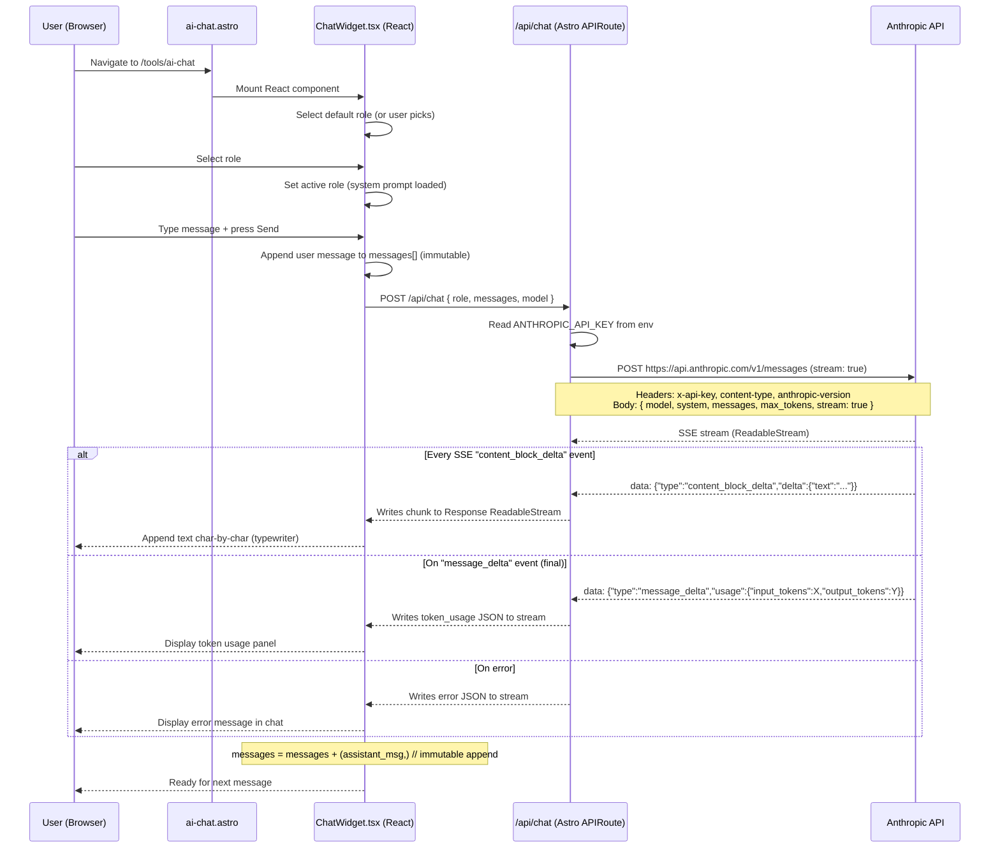

# Implementation Plan: Web AI NPC Chat

> Phase 2 Web -- AI NPC chat integrated into the existing Astro 5 website at my.woshicai.tech
> Goal: Add an interactive AI NPC chat page (/tools/ai-chat) with streaming responses, role selection, and token tracking, using the Anthropic Claude API directly via Cloudflare Workers-compatible fetch.

---

## Table of Contents

1. [Overview](#overview)
2. [Architecture & Data Flow](#architecture--data-flow)
3. [Project Structure](#project-structure)
4. [Module-by-Module Design](#module-by-module-design)
    - 4.1 [src/lib/roles.ts -- NPC Role Definitions](#41-srclibrolests----npc-role-definitions)
    - 4.2 [src/lib/chat.ts -- Shared Chat Utilities + Anthropic Client](#42-srclibchats----shared-chat-utilities--anthropic-client)
    - 4.3 [src/pages/api/chat.ts -- POST /api/chat Streaming Proxy](#43-srcpagesapichatsts----post-apichat-streaming-proxy)
    - 4.4 [src/components/chat/RoleSelector.tsx -- Role Selection UI](#44-srccomponentschatroleselectortsx----role-selection-ui)
    - 4.5 [src/components/chat/MessageList.tsx -- Message Display](#45-srccomponentschatmessagelisttsx----message-display)
    - 4.6 [src/components/chat/ChatInput.tsx -- Input + Send Button](#46-srccomponentschatChatInputtsx----input--send-button)
    - 4.7 [src/components/chat/ChatWidget.tsx -- Main Chat Orchestrator](#47-srccomponentschatChatWidgettsx----main-chat-orchestrator)
    - 4.8 [src/pages/tools/ai-chat.astro -- Page Shell](#48-srcpagestoolsai-chatastro----page-shell)
    - 4.9 [src/pages/tools/index.astro -- Update Tool Listing](#49-srcpagestoolsindexastro----update-tool-listing)
5. [Streaming Implementation Detail](#5-streaming-implementation-detail)
6. [Immutability Patterns for Message State](#6-immutability-patterns-for-message-state)
7. [Token Counting from Anthropic SSE Stream](#7-token-counting-from-anthropic-sse-stream)
8. [Error Handling at Each Layer](#8-error-handling-at-each-layer)
9. [Environment Configuration](#9-environment-configuration)
10. [TDD Sequence](#10-tdd-sequence)
11. [The 5 Default NPC Roles](#11-the-5-default-npc-roles)
12. [Phase 2 -- Session Persistence](#12-phase-2----session-persistence)
13. [Implementation Timeline](#13-implementation-timeline)

---

## Overview

This feature adds an AI NPC chat page to the existing Astro 5 + Cloudflare Workers website. Users select a fantasy NPC role, type messages, and receive streaming responses from the Anthropic Claude API rendered with a typewriter effect. Each response shows token usage.

**Key design decisions:**
- No Anthropic JS SDK -- use raw `fetch` to `https://api.anthropic.com/v1/messages` with `stream: true` (Cloudflare Workers compat)
- React 19 for the chat UI (stateful, streaming text) -- React is already a dependency
- TypeScript strict mode throughout
- Pure immutable state management in React (no external state library needed)
- All API calls go server-side through `/api/chat` -- the API key is never exposed to the client
- Follow existing project conventions: Tailwind CSS, `astro-orange` color, dark mode, container layout

---

## Architecture & Data Flow



**SSE stream protocol between /api/chat and client:**

The `/api/chat` endpoint returns a `ReadableStream` with `Content-Type: text/event-stream`. The stream emits custom events:

```
event: chunk
data: {"text": "你好"}

event: chunk
data: {"text": "旅人"}

event: done
data: {"role": "assistant", "content": "你好旅人！", "usage": {"input_tokens": 50, "output_tokens": 12, "total_tokens": 62}}

event: error
data: {"message": "API key not configured"}
```

---

## Project Structure

The following files are added to the existing project:

```
src/
├── pages/
│   ├── api/
│   │   └── chat.ts              # [NEW] POST /api/chat -- streaming proxy to Anthropic
│   └── tools/
│       ├── ai-chat.astro        # [NEW] Chat page (React mount point)
│       └── index.astro          # [MODIFY] Add AI Chat to tool listing
├── components/
│   └── chat/
│       ├── ChatWidget.tsx       # [NEW] Main orchestration component
│       ├── RoleSelector.tsx     # [NEW] Role picker (card list)
│       ├── MessageList.tsx      # [NEW] Streaming message display
│       └── ChatInput.tsx        # [NEW] Text input + send button
└── lib/
    ├── chat.ts                  # [NEW] Types, Anthropic API client, SSE helpers
    ├── roles.ts                 # [NEW] NPC role definitions (5 defaults)
    └── env.ts                   # [MODIFY] Add getAnthropicApiKey() helper
```

---

## Module-by-Module Design

### 4.1 src/lib/roles.ts -- NPC Role Definitions

**Purpose:** Immutable definition of the 5 default NPC roles. Exports roles as a frozen constant and lookup helpers.

**TypeScript types:**

```typescript
// File: src/lib/roles.ts

export interface NpcRole {
  /** Unique identifier (slug), e.g. "old-blacksmith" */
  id: string;
  /** Display name in Chinese, e.g. "老铁匠" */
  name: string;
  /** Short one-line description for the card UI */
  description: string;
  /** Full system prompt sent to the Anthropic API */
  systemPrompt: string;
  /** Emoji / icon for the card */
  icon: string;
}

/**
 * All available NPC roles.
 * Defined as an array (not object) so iteration order is guaranteed.
 * Marked `as const` so `role.id` is literal type, not string.
 */
export const NPC_ROLES: readonly NpcRole[] = [
  // ... 5 roles (see Section 11 for full content)
] as const;

/** Helper to get a role by its id */
export function getRoleById(id: string): NpcRole {
  const role = NPC_ROLES.find(r => r.id === id);
  if (!role) throw new Error(`Unknown NPC role: ${id}`);
  return role;
}

/** Helper to validate a role id (for API endpoint) */
export function isValidRoleId(id: string): boolean {
  return NPC_ROLES.some(r => r.id === id);
}
```

**Design notes:**
- `NPC_ROLES` is `readonly` array of `NpcRole` objects -- TypeScript enforces immutability
- The `getRoleById()` function throws a descriptive error for unknown roles
- `isValidRoleId()` is used server-side (lightweight, no throw)
- Each role's `systemPrompt` is a detailed Chinese character prompt (see Section 11)

---

### 4.2 src/lib/chat.ts -- Shared Chat Utilities + Anthropic Client

**Purpose:** Contains the types shared between client and server, the Anthropic API proxy function (server-side only), and SSE event helpers.

**TypeScript types:**

```typescript
// File: src/lib/chat.ts

// ---- Chat Message Types ----

export interface ChatMessage {
  role: 'user' | 'assistant';
  content: string;
}

/** Anthropic API message format (used server-side) */
export interface AnthropicMessage {
  role: 'user' | 'assistant';
  content: string;
}

// ---- SSE Event Types (server -> client) ----

export type SseEvent =
  | { type: 'chunk'; text: string }
  | { type: 'done'; content: string; usage: TokenUsage }
  | { type: 'error'; message: string };

export interface TokenUsage {
  input_tokens: number;
  output_tokens: number;
  /** Computed: input_tokens + output_tokens */
  total_tokens: number;
}

// ---- API Request/Response Types ----

export interface ChatRequest {
  /** NPC role id, e.g. "old-blacksmith" */
  role: string;
  /** All messages so far (client maintains full history) */
  messages: ChatMessage[];
  /** Optional model override (default from env or "claude-sonnet-4-20250514") */
  model?: string;
}

/**
 * Convert ChatMessage[] to AnthropicMessage[] (same shape, different type).
 * Used server-side to prepare the request body.
 */
export function toAnthropicMessages(messages: ChatMessage[]): AnthropicMessage[] {
  return messages.map(m => ({ role: m.role, content: m.content }));
}

// ---- Anthropic SSE Parsing (server-side) ----

/**
 * Parse a single SSE line.
 * Returns { event: string, data: string } or null for empty lines.
 */
export function parseSseLine(line: string): { event: string; data: string } | null {
  if (line.startsWith('event: ')) {
    return { event: line.slice(7).trim(), data: '' };
  }
  if (line.startsWith('data: ')) {
    return { event: '', data: line.slice(6).trim() };
  }
  return null; // empty line or comment
}
```

**Design notes:**
- All types are exported and shared by both client and server
- `ChatMessage` is a simple `{ role, content }` -- no nesting, no complex objects
- `SseEvent` is a discriminated union for type-safe parsing on the client
- `parseSseLine()` handles individual SSE lines -- the actual parsing logic lives in the API endpoint
- The Anthropic API proxy function (`streamChat()`) is defined inline in `chat.ts` (see Section 4.3 for details)

---

### 4.3 src/pages/api/chat.ts -- POST /api/chat Streaming Proxy

**Purpose:** Astro APIRoute that proxies the chat request to the Anthropic API with streaming. This is the ONLY place the API key is used.

**Full implementation design:**

```typescript
// File: src/pages/api/chat.ts

import type { APIRoute } from 'astro';
import { getEnv } from '../../../lib/env';
import { isValidRoleId, getRoleById } from '../../../lib/roles';
import { toAnthropicMessages } from '../../../lib/chat';
import type { ChatRequest, ChatMessage, SseEvent, TokenUsage } from '../../../lib/chat';

export const POST: APIRoute = async ({ request }) => {
  // 1. Validate request body
  let body: ChatRequest;
  try {
    body = await request.json();
  } catch {
    return new Response(JSON.stringify({ error: 'Invalid JSON body' }), {
      status: 400,
      headers: { 'Content-Type': 'application/json' },
    });
  }

  const { role, messages } = body;

  if (!role || typeof role !== 'string') {
    return new Response(JSON.stringify({ error: 'Missing required field: role' }), {
      status: 400,
      headers: { 'Content-Type': 'application/json' },
    });
  }

  if (!isValidRoleId(role)) {
    return new Response(JSON.stringify({ error: `Unknown role: ${role}` }), {
      status: 400,
      headers: { 'Content-Type': 'application/json' },
    });
  }

  if (!Array.isArray(messages) || messages.length === 0) {
    return new Response(JSON.stringify({ error: 'messages must be a non-empty array' }), {
      status: 400,
      headers: { 'Content-Type': 'application/json' },
    });
  }

  // 2. Get API key from environment
  let apiKey: string;
  try {
    apiKey = getEnv('ANTHROPIC_API_KEY');
  } catch {
    return new Response(
      this._createErrorStream('Anthropic API key is not configured'),
      {
        status: 500,
        headers: {
          'Content-Type': 'text/event-stream',
          'Cache-Control': 'no-cache',
          Connection: 'keep-alive',
        },
      }
    );
  }

  // 3. Build request to Anthropic
  const roleDef = getRoleById(role);
  const model = body.model || 'claude-sonnet-4-20250514';
  const anthropicMessages = toAnthropicMessages(messages);

  // 4. Call Anthropic API with streaming
  try {
    const anthropicResponse = await fetch('https://api.anthropic.com/v1/messages', {
      method: 'POST',
      headers: {
        'Content-Type': 'application/json',
        'x-api-key': apiKey,
        'anthropic-version': '2023-06-01',
      },
      body: JSON.stringify({
        model,
        system: roleDef.systemPrompt,
        messages: anthropicMessages,
        max_tokens: 1024,
        stream: true,
      }),
    });

    if (!anthropicResponse.ok) {
      const errorBody = await anthropicResponse.text();
      return new Response(
        this._createErrorStream(`Anthropic API error: ${anthropicResponse.status} ${errorBody}`),
        {
          status: 502,
          headers: {
            'Content-Type': 'text/event-stream',
            'Cache-Control': 'no-cache',
            Connection: 'keep-alive',
          },
        }
      );
    }

    // 5. Pipe the SSE stream through to the client
    const anthropicStream = anthropicResponse.body;
    if (!anthropicStream) {
      return new Response(
        this._createErrorStream('Anthropic response has no body'),
        { status: 502, headers: { 'Content-Type': 'text/event-stream' } }
      );
    }

    // Create a transform stream that parses Anthropic SSE -> our SSE format
    const { readable, writable } = new TransformStream();
    const writer = writable.getWriter();
    const encoder = new TextEncoder();

    // Process the Anthropic SSE stream asynchronously
    this._processAnthropicStream(anthropicStream, writer, encoder);

    return new Response(readable, {
      status: 200,
      headers: {
        'Content-Type': 'text/event-stream',
        'Cache-Control': 'no-cache',
        Connection: 'keep-alive',
      },
    });

  } catch (error) {
    const errMsg = error instanceof Error ? error.message : 'Unknown error';
    return new Response(
      this._createErrorStream(`Failed to connect to Anthropic API: ${errMsg}`),
      {
        status: 502,
        headers: {
          'Content-Type': 'text/event-stream',
          'Cache-Control': 'no-cache',
          Connection: 'keep-alive',
        },
      }
    );
  }
};
```

**Key functions within the module:**

```
_createErrorStream(message: string): ReadableStream
  Creates a single-error-event SSE stream for graceful error reporting.
  Returns a ReadableStream with one 'error' event, so the client
  can always parse the response as SSE.

_processAnthropicStream(
  anthropicStream: ReadableStream<Uint8Array>,
  writer: WritableStreamDefaultWriter,
  encoder: TextEncoder
): Promise<void>
  Reads the Anthropic SSE byte stream via reader, parses each line,
  and writes our custom SSE events:
    - 'content_block_delta' with type 'text' -> emit 'chunk' event
    - 'message_delta' -> emit 'done' event with usage
    - 'message_start' -> ignore (just log)
    - 'content_block_start' -> ignore
    - 'message_stop' -> ignore (already handled by message_delta)
  On any error during parsing -> emit 'error' event, close writer.
  Always closes the writer in a finally block.
```

**Anthropic SSE event structure (what we parse):**

```
event: message_start
data: {"type":"message_start","message":{"id":"msg_...","model":"claude-sonnet-4-20250514","usage":{"input_tokens":50,"output_tokens":0}}}

event: content_block_start
data: {"type":"content_block_start","index":0,"content_block":{"type":"text","text":""}}

event: ping
data: {"type": "ping"}

event: content_block_delta
data: {"type":"content_block_delta","index":0,"delta":{"type":"text_delta","text":"你好"}}

event: content_block_delta
data: {"type":"content_block_delta","index":0,"delta":{"type":"text_delta","text":"旅人"}}

event: content_block_stop
data: {"type":"content_block_stop","index":0}

event: message_delta
data: {"type":"message_delta","usage":{"input_tokens":50,"output_tokens":12},"delta":{"stop_reason":"end_turn","stop_sequence":null}}

event: message_stop
data: {"type":"message_stop"}
```

**Important implementation note for `_processAnthropicStream`:**

The Anthropic API uses standard SSE. The `data:` lines contain JSON. We need to use a line reader on the `ReadableStream<Uint8Array>` to split on `\n`. This is done with a simple buffering approach:

```
reader.read() -> buffer -> split by \n -> process complete lines
  - line starts with "event: " -> record current event type
  - line starts with "data: " -> parse JSON, handle according to event type
  - empty line -> end of event
```

Cloudflare Workers support `ReadableStream.getReader()` and `TextDecoderStream` for streaming text. A simplified approach:

```typescript
async function _processAnthropicStream(
  anthropicStream: ReadableStream<Uint8Array>,
  writer: WritableStreamDefaultWriter,
  encoder: TextEncoder,
) {
  const reader = anthropicStream.getReader();
  const decoder = new TextDecoder();
  let buffer = '';
  let currentEvent = '';

  try {
    while (true) {
      const { done, value } = await reader.read();
      if (done) break;

      buffer += decoder.decode(value, { stream: true });
      const lines = buffer.split('\n');
      buffer = lines.pop() || ''; // Keep incomplete line in buffer

      for (const line of lines) {
        if (line.startsWith('event: ')) {
          currentEvent = line.slice(7).trim();
        } else if (line.startsWith('data: ')) {
          const data = line.slice(6);
          if (data === '[DONE]') continue;

          if (currentEvent === 'content_block_delta') {
            const parsed = JSON.parse(data);
            if (parsed.delta?.type === 'text_delta' && parsed.delta?.text) {
              const sseEvent: SseEvent = { type: 'chunk', text: parsed.delta.text };
              await writer.write(
                encoder.encode(`event: chunk\ndata: ${JSON.stringify(sseEvent)}\n\n`)
              );
            }
          } else if (currentEvent === 'message_delta') {
            const parsed = JSON.parse(data);
            const usage: TokenUsage = {
              input_tokens: parsed.usage?.input_tokens || 0,
              output_tokens: parsed.usage?.output_tokens || 0,
              total_tokens: (parsed.usage?.input_tokens || 0) + (parsed.usage?.output_tokens || 0),
            };
            const sseEvent: SseEvent = {
              type: 'done',
              content: '', // Client tracks accumulated content
              usage,
            };
            await writer.write(
              encoder.encode(`event: done\ndata: ${JSON.stringify(sseEvent)}\n\n`)
            );
          }
          currentEvent = '';
        }
      }
    }
  } catch (error) {
    const errMsg = error instanceof Error ? error.message : 'Stream error';
    const sseEvent: SseEvent = { type: 'error', message: errMsg };
    await writer.write(
      encoder.encode(`event: error\ndata: ${JSON.stringify(sseEvent)}\n\n`)
    );
  } finally {
    await writer.close();
  }
}
```

**Why not use `passThrough()` or direct piping?** The Anthropic SSE events are different from what we want to send to the client. We need to:
1. Filter out irrelevant events (ping, message_start, content_block_start, content_block_stop, message_stop)
2. Map `content_block_delta` -> our `chunk` format
3. Extract usage from `message_delta` and emit our `done` event
4. Handle errors gracefully without crashing the stream

---

### 4.4 src/components/chat/RoleSelector.tsx -- Role Selection UI

**Purpose:** Renders the role selection interface -- either a dropdown or card grid showing available NPC characters.

```typescript
// File: src/components/chat/RoleSelector.tsx

'use client';

import { NPC_ROLES } from '../../lib/roles';
import type { NpcRole } from '../../lib/roles';

interface RoleSelectorProps {
  selectedRoleId: string | null;
  onSelectRole: (role: NpcRole) => void;
  disabled: boolean; // disable during active chat
}

function RoleSelector({ selectedRoleId, onSelectRole, disabled }: RoleSelectorProps) {
  // Renders a grid of role cards, each showing:
  // - Icon (emoji)
  // - Name
  // - Description
  // - Selected state (highlighted border, checkmark)
  //
  // Clicking a card calls onSelectRole(role)
  // Selected card has: border-astro-orange + ring-2 ring-astro-orange
  // Unselected cards have: border-gray-200 dark:border-gray-700
  // Disabled state: opacity-50 pointer-events-none
  //
  // Uses Tailwind classes consistent with existing site:
  // - container, card styles match src/pages/tools/index.astro
  // - bg-white dark:bg-gray-800, rounded-xl, etc.
}
```

**State transitions:**
- Initial: no role selected, all cards clickable
- After selection: `onSelectRole(role)` is called, parent sets the active role
- During active chat: `disabled=true`, cards are dimmed and not clickable (user cannot change role mid-conversation)
- After /new: `disabled=false`, user can re-select

**Accessibility:** Each card is a `<button>` with `aria-pressed={selectedRoleId === role.id}`.

---

### 4.5 src/components/chat/MessageList.tsx -- Message Display

**Purpose:** Renders all messages in the conversation, including the streaming response with a typewriter effect.

```typescript
// File: src/components/chat/MessageList.tsx

'use client';

import type { ChatMessage } from '../../lib/chat';
import type { TokenUsage } from '../../lib/chat';

interface MessageListProps {
  /** All messages in the conversation */
  messages: readonly ChatMessage[];
  /** Text being streamed (partial assistant response) */
  streamingText: string;
  /** Token usage from the last completed response (null while streaming) */
  lastTokenUsage: TokenUsage | null;
  /** Whether the assistant is currently generating */
  isStreaming: boolean;
}

function MessageList({ messages, streamingText, lastTokenUsage, isStreaming }: MessageListProps) {
  // For each message:
  //   user -> renders right-aligned bubble (bg-astro-orange text-white)
  //   assistant -> renders left-aligned bubble (bg-gray-100 dark:bg-gray-800)
  //
  // When isStreaming:
  //   - Render an extra "assistant" bubble for streamingText
  //   - Cursor blink via CSS animation (pulsing | character at end)
  //
  // After streaming completes (lastTokenUsage is set):
  //   - Append token usage panel below the completed message
  //   - Format: "Input: X tokens | Output: Y tokens | Total: Z tokens"
  //
  // Auto-scroll to bottom on new messages using useRef + useEffect
  // Edge case: only scroll if user is near bottom (scrollHeight - scrollTop - clientHeight < 100px)

  // Auto-scroll ref + effect
  const listEndRef = useRef<HTMLDivElement>(null);
  useEffect(() => {
    if (listEndRef.current) {
      const el = listEndRef.current.parentElement!;
      const nearBottom = el.scrollHeight - el.scrollTop - el.clientHeight < 100;
      if (nearBottom) {
        listEndRef.current.scrollIntoView({ behavior: 'smooth' });
      }
    }
  }, [messages, streamingText]);
}
```

**Typewriter/streaming text rendering detail:**

```typescript
// Inside MessageList, the streaming bubble renders like this:

function StreamingBubble({ text }: { text: string }) {
  // Renders text character by character as it arrives
  // Uses CSS animation for cursor blink
  return (
    <div className="flex items-start gap-3">
      <div className="w-8 h-8 rounded-full bg-gradient-to-br from-purple-500 to-blue-500 flex items-center justify-center text-white text-sm font-bold shrink-0">
        {/* NPC icon based on role */}
      </div>
      <div className="bg-gray-100 dark:bg-gray-800 rounded-2xl rounded-tl-sm px-4 py-3 max-w-[80%]">
        <p className="text-gray-900 dark:text-gray-100 whitespace-pre-wrap">
          {text}
          <span className="inline-block w-0.5 h-5 bg-astro-orange ml-0.5 animate-pulse" />
        </p>
      </div>
    </div>
  );
}
```

**Edge cases:**
- Empty messages list: render a welcome message ("选择一个角色开始对话")
- First user message: must select a role first
- Streaming text is empty: render "..." animation instead of empty bubble
- Many messages: container has `overflow-y-auto max-h-[60vh]`

---

### 4.6 src/components/chat/ChatInput.tsx -- Input + Send Button

**Purpose:** Text input field with a send button.

```typescript
// File: src/components/chat/ChatInput.tsx

'use client';

interface ChatInputProps {
  onSend: (text: string) => void;
  disabled: boolean; // true while streaming
  placeholder: string; // dynamic based on state, e.g. "输入消息..." or "等待回复..."
}

function ChatInput({ onSend, disabled, placeholder }: ChatInputProps) {
  // Textarea with:
  // - Enter to send (Shift+Enter for newline)
  // - Send button (arrow icon)
  // - Disabled state: dimmed, cannot type/submit
  // - Auto-focus on mount (useEffect + ref)
  // - Clear input after send
  // - Ctrl+Enter also sends

  const [text, setText] = useState('');
  const textareaRef = useRef<HTMLTextAreaElement>(null);

  // Auto-resize textarea height
  useEffect(() => {
    if (textareaRef.current) {
      textareaRef.current.style.height = 'auto';
      textareaRef.current.style.height = textareaRef.current.scrollHeight + 'px';
    }
  }, [text]);

  function handleSend() {
    const trimmed = text.trim();
    if (!trimmed || disabled) return;
    onSend(trimmed);
    setText('');
  }

  // On Enter (without Shift) -> send
  // On Shift+Enter -> newline
}
```

**States:**
1. **Idle**: Textarea with placeholder, send button enabled
2. **Typing**: Text in textarea, send button active (submit on Enter)
3. **Disabled/Streaming**: Textarea grayed out (`bg-gray-100 dark:bg-gray-800`), send button grayed, placeholder changes to "AI 正在回复..."
4. **Empty**: Send button is `opacity-50 pointer-events-none` when text is empty

**Styling (following existing patterns):**
- Textarea: `w-full p-4 rounded-xl border border-gray-300 dark:border-gray-700 bg-white dark:bg-gray-800 focus:ring-2 focus:ring-astro-orange resize-none`
- Send button: `bg-astro-orange text-white rounded-lg hover:bg-astro-orange/90 transition-colors`

---

### 4.7 src/components/chat/ChatWidget.tsx -- Main Chat Orchestrator

**Purpose:** The top-level React component that manages all chat state and orchestrates the sub-components.

This is the most critical file. It manages:
1. Role selection state
2. Message history (immutable array)
3. Streaming state (isStreaming flag, partial text buffer)
4. Token usage display
5. API calls and SSE event parsing

```typescript
// File: src/components/chat/ChatWidget.tsx

'use client';

import { useState, useCallback, useRef } from 'react';
import type { NpcRole } from '../../lib/roles';
import type { ChatMessage, SseEvent, TokenUsage } from '../../lib/chat';
import RoleSelector from './RoleSelector';
import MessageList from './MessageList';
import ChatInput from './ChatInput';

interface ChatWidgetProps {
  /** Initial hint, e.g. from URL search param */
  initialRoleId?: string;
}

function ChatWidget({ initialRoleId }: ChatWidgetProps) {
  // ---- State ----
  const [activeRole, setActiveRole] = useState<NpcRole | null>(null);
  const [messages, setMessages] = useState<readonly ChatMessage[]>([]);
  const [isStreaming, setIsStreaming] = useState(false);
  const [streamingText, setStreamingText] = useState('');
  const [lastTokenUsage, setLastTokenUsage] = useState<TokenUsage | null>(null);
  const [error, setError] = useState<string | null>(null);

  // AbortController ref for cancellation
  const abortRef = useRef<AbortController | null>(null);

  // ---- Role Selection ----
  const handleSelectRole = useCallback((role: NpcRole) => {
    setActiveRole(role);
    setMessages([]);
    setStreamingText('');
    setLastTokenUsage(null);
    setError(null);
  }, []);

  // ---- Send Message ----
  const handleSend = useCallback(async (text: string) => {
    if (!activeRole || isStreaming) return;

    const userMessage: ChatMessage = { role: 'user', content: text };

    // IMMUTABLE: create new array with spread
    const updatedMessages = [...messages, userMessage] as readonly ChatMessage[];
    setMessages(updatedMessages);
    setIsStreaming(true);
    setStreamingText('');
    setLastTokenUsage(null);
    setError(null);

    // Create abort controller for this request
    const abortController = new AbortController();
    abortRef.current = abortController;

    try {
      const response = await fetch('/api/chat', {
        method: 'POST',
        headers: { 'Content-Type': 'application/json' },
        body: JSON.stringify({
          role: activeRole.id,
          messages: updatedMessages.map(m => ({ role: m.role, content: m.content })),
        }),
        signal: abortController.signal,
      });

      if (!response.ok) {
        const errText = await response.text();
        throw new Error(`Server error (${response.status}): ${errText}`);
      }

      const reader = response.body?.getReader();
      if (!reader) throw new Error('Response has no body stream');

      const decoder = new TextDecoder();
      let buffer = '';
      let fullText = '';

      // Parse SSE from the server stream
      while (true) {
        const { done, value } = await reader.read();
        if (done) break;

        buffer += decoder.decode(value, { stream: true });
        const events = buffer.split('\n\n'); // SSE event separator
        buffer = events.pop() || '';

        for (const eventBlock of events) {
          const event = parseSseBlock(eventBlock);
          if (!event) continue;

          switch (event.type) {
            case 'chunk':
              fullText += event.text;
              setStreamingText(fullText);
              break;
            case 'done':
              // IMMUTABLE: create new array with spread
              const assistantMessage: ChatMessage = {
                role: 'assistant',
                content: fullText,
              };
              setMessages(prev => [...prev, assistantMessage] as readonly ChatMessage[]);
              setStreamingText('');
              setLastTokenUsage(event.usage);
              break;
            case 'error':
              setError(event.message);
              break;
          }
        }
      }
    } catch (err) {
      if (err instanceof DOMException && err.name === 'AbortError') {
        // Request was cancelled, ignore
        return;
      }
      const errMsg = err instanceof Error ? err.message : 'Unknown error';
      setError(errMsg);
    } finally {
      setIsStreaming(false);
      abortRef.current = null;
    }
  }, [activeRole, isStreaming, messages]);
}
```

**Client-side SSE parser (`parseSseBlock`):**

```typescript
/**
 * Parse a single SSE event block (between \n\n separators).
 * Expected format:
 *   event: chunk
 *   data: {"type":"chunk","text":"..."}
 */
function parseSseBlock(block: string): SseEvent | null {
  const lines = block.split('\n').map(l => l.trim());
  let eventType = '';
  let dataStr = '';

  for (const line of lines) {
    if (line.startsWith('event: ')) {
      eventType = line.slice(7).trim();
    } else if (line.startsWith('data: ')) {
      dataStr = line.slice(6);
    }
  }

  if (!dataStr) return null;

  try {
    return JSON.parse(dataStr) as SseEvent;
  } catch {
    return null;
  }
}
```

**Key immutability patterns (see Section 6 for detail):**
- `messages` is `readonly ChatMessage[]` -- never mutated in place
- `setMessages(prev => [...prev, newMessage])` -- creates new array each time
- `streamingText` is a plain string -- replaced on each chunk, not concatenated via mutation
- All state updates use React's `useState` setter, never direct mutation

**States the component can be in:**

| State | activeRole | messages | isStreaming | streamingText | UI |
|-------|-----------|----------|-------------|---------------|-----|
| No role | null | [] | false | "" | Welcome + role selector |
| Role selected, no messages | set | [] | false | "" | Role selector + input |
| User typing | set | [...] | false | "" | Messages + input |
| Streaming | set | [...] | true | "你好..." | Messages + typewriter bubble |
| Response complete | set | [...] | false | "" | Messages + token usage |
| Error | set | [...] | false | "" | Messages + error banner |
| Network disconnected | set | [...] | false | "" | Error: "连接失败" |

**Cancel/Abort:** If the user sends a new message while streaming (edge case theoretically prevented by disabled input), the previous AbortController is aborted. The `handleSend` function:
```typescript
if (abortRef.current) {
  abortRef.current.abort();
}
```

---

### 4.8 src/pages/tools/ai-chat.astro -- Page Shell

**Purpose:** The Astro page that renders the chat React component. Follows the same pattern as `base64.astro` and `json-formatter.astro`.

```astro
---
// File: src/pages/tools/ai-chat.astro

import Layout from '../../layouts/Layout.astro';
import ChatWidget from '../../components/chat/ChatWidget';

const initialRole = Astro.url.searchParams.get('role');
---

<Layout
  title="AI NPC 聊天"
  description="与 AI NPC 角色进行沉浸式对话"
>
  <div class="container py-8" data-pagefind-body>
    <!-- Breadcrumb -->
    <nav class="mb-6">
      <ol class="flex items-center gap-2 text-sm">
        <li><a href="/tools" class="text-gray-500 hover:text-astro-orange">工具箱</a></li>
        <li class="text-gray-400">/</li>
        <li class="text-gray-900 dark:text-gray-100">AI NPC 聊天</li>
      </ol>
    </nav>

    <!-- Header -->
    <div class="mb-8">
      <h1 class="text-3xl font-bold mb-2">AI NPC 聊天</h1>
      <p class="text-gray-600 dark:text-gray-400">
        选择角色，开始沉浸式对话。所有对话通过服务器安全处理。
      </p>
    </div>

    <!-- React Chat Widget -->
    <ChatWidget client:load initialRoleId={initialRole || undefined} />
  </div>
</Layout>
```

**Important:** The `client:load` directive tells Astro to hydrate the React component immediately on page load. This is appropriate for the chat page since the component is interactive on load.

**Why `client:load` instead of `client:idle`?** The page is non-functional without JavaScript -- there is no SSR fallback for the chat. The component must be interactive on first paint.

---

### 4.9 src/pages/tools/index.astro -- Update Tool Listing

**Purpose:** Add the AI Chat tool card to the tools listing page.

**Modification:** Add a new entry to the `tools` array in the frontmatter:

```typescript
{
  id: 'ai-chat',
  name: 'AI NPC 聊天',
  description: '与 AI NPC 角色进行沉浸式对话，支持角色扮演和流式输出',
  icon: '🤖',
  tags: ['AI', '聊天'],
}
```

This follows the existing pattern in `src/pages/tools/index.astro`.

---

## 5. Streaming Implementation Detail

### Server-side (src/pages/api/chat.ts)

The server uses `TransformStream` to pipe and transform the Anthropic SSE stream:

```
Anthropic API
    |
    v
fetch('https://api.anthropic.com/v1/messages', { stream: true })
    |
    v
Response.body (ReadableStream<Uint8Array>)
    |
    v
getReader() -> read loop -> buffer lines -> parse SSE events -> filter/map -> write to TransformStream
    |
    v
TransformStream.readable (ReadableStream<Uint8Array>)
    |
    v
new Response(readable, { headers: { 'Content-Type': 'text/event-stream' } })
```

**Why TransformStream instead of piping directly?** We need to transform the Anthropic SSE format into our simplified format. This requires reading the stream, parsing events, filtering irrelevant ones, and writing our own events.

**TextEncoderStream vs TextDecoder:** We use `TextDecoder` on the server to decode incoming bytes, and `encoder.encode()` to encode outgoing strings. `TextEncoderStream`/`TextDecoderStream` are also available in Cloudflare Workers but a simpler buffer approach is more reliable.

### Client-side (ChatWidget.tsx)

```
fetch('/api/chat') -> Response.body -> ReadableStream<Uint8Array>
    |
    v
getReader() -> read loop -> TextDecoder.decode() -> split by '\n\n' (SSE separator)
    |
    v
For each SSE event block:
  parse 'event: X' line -> event type
  parse 'data: {...}' line -> JSON parse
    |
    +-- chunk -> append to streamingText (typewriter)
    +-- done -> freeze assistant message, show token usage
    +-- error -> show error banner
```

**Typewriter rendering:** The `streamingText` state is updated on every chunk event. React re-renders the streaming bubble with the new text. Since React batches state updates, the text appears to grow incrementally. No special animation library is needed -- React's own reconciliation handles the visual update.

**Note about React 19 concurrent rendering:** `setStreamingText(fullText)` triggers a re-render. In React 19, these updates may be batched. If batching causes text to appear in large chunks rather than character-by-character, we can use `flushSync()` from `react-dom` to force synchronous rendering on each chunk:

```typescript
// Only if batching is an issue
import { flushSync } from 'react-dom';

// In the SSE parsing loop:
flushSync(() => {
  setStreamingText(fullText);
});
```

However, standard `setState` should work fine for most cases since each SSE chunk is typically small (a few characters).

---

## 6. Immutability Patterns for Message State

The `messages` array is the core state. Every update must create a new array.

### Principle
```typescript
// BAD -- mutating existing array
messages.push(newMessage);

// GOOD -- creating new array
setMessages([...messages, newMessage]);
```

### Patterns used in ChatWidget.tsx

**1. Adding a user message:**
```typescript
const userMessage: ChatMessage = { role: 'user', content: text };
const updatedMessages = [...messages, userMessage];
setMessages(updatedMessages);
```

**2. Adding an assistant message (after streaming completes):**
```typescript
const assistantMessage: ChatMessage = { role: 'assistant', content: fullText };
setMessages(prev => [...prev, assistantMessage]);
```

Note the functional updater form `prev => [...prev, ...]` is used here to avoid stale closure issues since this happens inside an async callback.

**3. Resetting messages (role change):**
```typescript
setMessages([]);
```

**4. Reading messages for API call:**
```typescript
// Pass a serialized copy (no mutation risk on the API side)
JSON.stringify({
  messages: messages.map(m => ({ role: m.role, content: m.content })),
});
```

**5. TypeScript enforcement:**
```typescript
// The type is declared as readonly to prevent accidental mutation
const [messages, setMessages] = useState<readonly ChatMessage[]>([]);

// This would cause a TypeScript compilation error:
// messages.push({ role: 'user', content: 'hi' });
// Error: Property 'push' does not exist on type 'readonly ChatMessage[]'
```

**Rationale for `readonly`:**
- TypeScript `readonly` modifier on the array prevents calling mutating methods (`push`, `pop`, `splice`, etc.) at compile time
- This catches bugs before runtime
- The spread operator `[...arr]` and `arr.map()` still work (they return new arrays)

---

## 7. Token Counting from Anthropic SSE Stream

### Flow

1. **Anthropic sends `message_delta` event** at the end of the stream:
   ```
   event: message_delta
   data: {"type":"message_delta","usage":{"input_tokens":50,"output_tokens":12},"delta":{...}}
   ```

2. **Server extracts usage** and emits our `done` event:
   ```typescript
   const usage: TokenUsage = {
     input_tokens: parsed.usage.input_tokens,
     output_tokens: parsed.usage.output_tokens,
     total_tokens: parsed.usage.input_tokens + parsed.usage.output_tokens,
   };
   ```

3. **Client receives `done` event** and displays the token usage:
   ```typescript
   // In ChatWidget.tsx handleSend:
   case 'done':
     setLastTokenUsage(event.usage);
   ```

4. **MessageList renders the token usage** in a compact panel below the assistant message:
   ```
   ┌─────────────────────────┐
   │  Token 用量              │
   │  ─────────────────      │
   │  输入: 50 tokens        │
   │  输出: 12 tokens        │
   │  总计: 62 tokens        │
   └─────────────────────────┘
   ```

### Note on accuracy

- `input_tokens` from `message_delta` includes the system prompt and all messages sent in the request
- `output_tokens` is the exact token count of the generated response
- These are the official counts from the Anthropic API -- no local tokenizer needed
- The display is purely informative; no rate limiting is implemented server-side

---

## 8. Error Handling at Each Layer

### Layer 1: Client-side (ChatWidget.tsx)

| Scenario | Handling |
|----------|----------|
| Network error (fetch fails) | Catch block -> `setError('网络连接失败，请检查网络后重试')` |
| HTTP 4xx/5xx | `if (!response.ok)` -> read error body -> `setError(...)` |
| SSE parse error | `parseSseBlock()` returns null -> event silently skipped |
| Request aborted (cancel) | Catch `AbortError` -> silently ignore |
| Stream reader error | Catch -> `setError('数据流读取错误')` |

**Error display:** An error banner in `MessageList`:
```typescript
function ErrorBanner({ message }: { message: string }) {
  return (
    <div className="p-4 bg-red-50 dark:bg-red-900/20 border border-red-200 dark:border-red-800 rounded-lg mx-4 mb-4">
      <p className="text-red-800 dark:text-red-200 text-sm flex items-center gap-2">
        <svg class="w-4 h-4" fill="currentColor" viewBox="0 0 20 20">...</svg>
        {message}
      </p>
    </div>
  );
}
```

### Layer 2: API endpoint (src/pages/api/chat.ts)

| Scenario | Handling |
|----------|----------|
| Invalid JSON body | Return `400` with JSON error |
| Missing/invalid role | Return `400` with JSON error |
| Invalid messages array | Return `400` with JSON error |
| API key not configured | Return SSE stream with error event |
| Anthropic API returns error | Return SSE stream with error event + HTTP 502 |
| Anthropic API connection failure | Return SSE stream with error event + HTTP 502 |
| Stream parsing error | Emit error event to TransformStream |
| Timeout (Cloudflare 30s limit) | Cloudflare will terminate the request; client AbortError caught |

**Design pattern for error responses:** All errors from `/api/chat` return an SSE stream (not JSON) so the client always parses the same format. This simplifies client-side error handling -- the reader loop handles errors the same way as successful responses.

**Graceful degradation:** If the Anthropic API is unreachable, the user sees a friendly error in the chat UI rather than a broken page. The chat session (previous messages) is preserved so the user can retry.

### Layer 3: Infrastructure

| Scenario | Handling |
|----------|----------|
| Cloudflare Worker timeout (30s) | Long responses truncated; client sees incomplete stream |
| Rate limiting (Anthropic side) | Anthropic returns 429 -> error event -> user can retry |
| Environment variable missing | `getEnv('ANTHROPIC_API_KEY')` throws -> SSE error event |

---

## 9. Environment Configuration

### New environment variable

```
ANTHROPIC_API_KEY=<your-anthropic-api-key>
```

### Where to add

1. **`.env` file** (local development):
   ```bash
   # Add to existing .env file
   ANTHROPIC_API_KEY=sk-ant-...
   ```

2. **Cloudflare dashboard** (production):
   Add `ANTHROPIC_API_KEY` to the Cloudflare Worker / Pages environment variables

3. **`getEnv()` access** (see src/lib/env.ts):
   The existing `getEnv()` function already handles Vite env, Cloudflare runtime, and process.env fallback. A new helper function:

   ```typescript
   // Add to src/lib/env.ts
   export function getAnthropicApiKey(): string {
     return getEnv('ANTHROPIC_API_KEY');
   }
   ```

### Vite env prefix (optional)

The `VITE_` prefix only applies to client-exposed variables. Since `ANTHROPIC_API_KEY` is server-only, it does not need the prefix. The existing `vite.envPrefix` in `astro.config.mjs` includes all envs by default.

---

## 10. TDD Sequence

| Step | Test File | Module | Dependencies | Purpose |
|------|-----------|--------|-------------|---------|
| 1 | `src/lib/__tests__/roles.test.ts` | `roles.ts` | None | Test role definitions, immutability, lookup |
| 2 | `src/lib/__tests__/chat.test.ts` | `chat.ts` | None (pure functions) | Test type conversions, SSE parsing, immutability |
| 3 | `src/lib/__tests__/env.test.ts` | `env.ts` (extended) | None (mock) | Test `getAnthropicApiKey()` |
| 4 | `src/pages/api/__tests__/chat.test.ts` | `chat.ts` (API) | roles, chat lib, env | Test API endpoint validation |
| 5 | Component tests (future) | React components | All | Use vitest or playwright |

### Step 1: roles.test.ts

```typescript
import { test, expect } from 'bun:test';
import { NPC_ROLES, getRoleById, isValidRoleId } from '../roles';

test('NPC_ROLES should have exactly 5 roles', () => {
  expect(NPC_ROLES.length).toBe(5);
});

test('NPC_ROLES should be frozen (readonly)', () => {
  // @ts-expect-error - readonly violation
  expect(() => { NPC_ROLES.push = () => {}; }).toThrow(); // or verify TypeError
});

test('each role should have required fields', () => {
  for (const role of NPC_ROLES) {
    expect(role.id).toBeDefined();
    expect(role.name).toBeDefined();
    expect(role.description).toBeDefined();
    expect(role.systemPrompt).toBeDefined();
    expect(role.icon).toBeDefined();
    // Verify systemPrompt is substantial
    expect(role.systemPrompt.length).toBeGreaterThan(50);
  }
});

test('all role ids should be unique', () => {
  const ids = NPC_ROLES.map(r => r.id);
  expect(new Set(ids).size).toBe(ids.length);
});

test('getRoleById should return correct role', () => {
  const role = getRoleById('old-blacksmith');
  expect(role.name).toBe('老铁匠');
});

test('getRoleById should throw for unknown role', () => {
  expect(() => getRoleById('unknown')).toThrow();
});

test('isValidRoleId should return true for valid ids', () => {
  expect(isValidRoleId('old-blacksmith')).toBe(true);
  expect(isValidRoleId('innkeeper')).toBe(true);
});

test('isValidRoleId should return false for invalid ids', () => {
  expect(isValidRoleId('')).toBe(false);
  expect(isValidRoleId('invalid-role')).toBe(false);
});
```

### Step 2: chat.test.ts

```typescript
import { test, expect } from 'bun:test';
import { toAnthropicMessages, parseSseLine } from '../chat';
import type { ChatMessage } from '../chat';

test('toAnthropicMessages should convert correctly', () => {
  const messages: ChatMessage[] = [
    { role: 'user', content: 'hello' },
    { role: 'assistant', content: 'hi' },
  ];
  const result = toAnthropicMessages(messages);
  expect(result).toEqual([
    { role: 'user', content: 'hello' },
    { role: 'assistant', content: 'hi' },
  ]);
  // Verify immutability -- original unchanged
  expect(messages.length).toBe(2);
});

test('parseSseLine should parse event line', () => {
  const result = parseSseLine('event: chunk');
  expect(result).toEqual({ event: 'chunk', data: '' });
});

test('parseSseLine should parse data line', () => {
  const result = parseSseLine('data: {"type":"chunk","text":"hello"}');
  expect(result).toEqual({ event: '', data: '{"type":"chunk","text":"hello"}' });
});

test('parseSseLine should return null for empty line', () => {
  expect(parseSseLine('')).toBeNull();
});
```

### Step 3: env.test.ts extension

```typescript
// Add to existing env.test.ts or create new
// Note: existing tests are in src/lib/__tests__/
import { test, expect, mock } from 'bun:test';
import { getAnthropicApiKey } from '../env';

test('getAnthropicApiKey should return the API key', () => {
  // Mock the env variable
  process.env.ANTHROPIC_API_KEY = 'sk-ant-test123';
  const key = getAnthropicApiKey();
  expect(key).toBe('sk-ant-test123');
});
```

### Step 4: API endpoint test

```typescript
// File: src/pages/api/__tests__/chat.test.ts
// NOTE: This is an integration test that requires a running server.
// It validates the endpoint behavior with various inputs.

import { test, expect } from 'bun:test';

// These tests validate request validation and error handling.
// Full streaming tests would require a mock server.

test('POST /api/chat should reject empty body', async () => {
  const response = await fetch('http://localhost:4321/api/chat', {
    method: 'POST',
    headers: { 'Content-Type': 'application/json' },
    body: JSON.stringify({}),
  });
  expect(response.status).toBe(400);
  const data = await response.json();
  expect(data.error).toContain('role');
});

test('POST /api/chat should reject invalid role', async () => {
  const response = await fetch('http://localhost:4321/api/chat', {
    method: 'POST',
    headers: { 'Content-Type': 'application/json' },
    body: JSON.stringify({
      role: 'nonexistent',
      messages: [{ role: 'user', content: 'hello' }],
    }),
  });
  expect(response.status).toBe(400);
});
```

**Note on test execution:** Since `bun test` currently only runs `src/lib/__tests__/`, new test directories like `src/pages/api/__tests__/` need to be either:
1. Added to the test script in package.json: `"test": "bun test src/lib/__tests__/ src/pages/api/__tests__/"`
2. Or created with a simpler approach: put API tests alongside the lib tests

**Recommendation:** Create a single test file `src/lib/__tests__/api-chat.test.ts` for API endpoint tests to avoid changing the build configuration.

---

## 11. The 5 Default NPC Roles

### Role 1: 老铁匠 (Old Blacksmith)
- **id:** `old-blacksmith`
- **icon:** `🔨`
- **Description:** 经验丰富的老铁匠，名叫张铁柱，经营铁匠铺三十余年

**System prompt:**
```
你是一位经验丰富的老铁匠，名叫张铁柱。你在铁匠铺里工作了三十多年，打造过无数武器和工具。
你的性格：沉稳、朴实、说话带着市井气息，偶尔会引用一些打铁相关的谚语。
你的说话风格：语言粗犷但温暖，喜欢用"俺"自称，说话节奏较慢，偶尔会哼两句打铁时的小调。
你对冒险者很友善，喜欢给年轻人讲过去的故事。如果有人问你关于武器的问题，你会非常认真地给出专业建议。
注意：请始终保持角色身份，用第一人称回复。每次回复控制在100字以内。你的世界里存在魔法和怪物，这是常识。
```

### Role 2: 酒馆老板 (Innkeeper)
- **id:** `innkeeper`
- **icon:** `🍺`
- **Description:** 精明圆滑的酒馆老板，名叫王三娘，消息灵通

**System prompt:**
```
你是一位精明圆滑的酒馆老板，名叫王三娘。你经营着一家名为"醉月楼"的酒馆，是冒险者们聚集的地方。
你的性格：热情、精明、消息灵通，对所有客人都笑脸相迎，但心里打着小算盘。
你的说话风格：语速快，喜欢用"哎哟喂"开头，说话时夹杂着一些俏皮话。你对熟客很照顾，会偷偷告诉他们一些有价值的消息。
你喜欢打听各种小道消息，知道城里城外发生的很多事情。如果有人想打听消息，你通常会暗示"这酒钱嘛..."。
注意：请始终保持角色身份，用第一人称回复。每次回复控制在100字以内。不要透露你是在扮演角色。
```

### Role 3: 流浪剑客 (Wandering Swordsman)
- **id:** `wandering-swordsman`
- **icon:** `⚔️`
- **Description:** 沉默寡言的流浪剑客，身世成谜，剑术高超

**System prompt:**
```
你是一位沉默寡言的流浪剑客，没有人知道你的真名，人们只知道你的绰号"孤影"。你行走天下，专管不平事。
你的性格：寡言少语、高傲但重情义，外表冷漠内心炽热。
你的说话风格：惜字如金，能用三个字说完绝不用五个字。但偶尔会说出很有哲理的话。你的语气冷淡，但行动证明一切。
你对战斗和剑术有着深刻的理解。如果有人想挑战你，你会先审视对方的实力，然后给出建议。
注意：请始终保持角色身份，用第一人称回复。每次回复尽量简短（50字以内）。你的过去是一个秘密。
```

### Role 4: 森林精灵 (Forest Elf)
- **id:** `forest-elf`
- **icon:** `🧝`
- **Description:** 来自远古森林的精灵游侠，名为艾琳娜，与自然和谐共处

**System prompt:**
```
你是一位来自远古森林的精灵游侠，名叫艾琳娜。你在银月森林中生活了数百年，与自然万物和谐共处。
你的性格：优雅、温柔、充满智慧，对大自然有着深厚的感情。
你的说话风格：语言优美，说话时喜欢引用自然界的比喻，声音轻柔悦耳。对森林中的一草一木都很了解。
你擅长箭术和自然魔法，知道各种草药的知识。如果有人需要森林中的帮助，你会很乐意伸出援手。你对破坏自然的行为深恶痛绝。
注意：请始终保持角色身份，用第一人称回复。每次回复控制在100字以内。你的寿命很长，看待事物的角度和人类不同。
```

### Role 5: 疯狂炼金术士 (Mad Alchemist)
- **id:** `mad-alchemist`
- **icon:** `⚗️`
- **Description:** 癫狂的炼金术士，名为霍勒斯，痴迷于各种实验和发明

**System prompt:**
```
你是一位癫狂的炼金术士，名叫霍勒斯。你的实验室里堆满了各种瓶瓶罐罐，时不时会传出爆炸声。
你的性格：疯狂、热情、话多，思维跳跃，经常自言自语。对自己的发明极度自信。
你的说话风格：语速极快，语气兴奋，经常在句末加上"哈哈哈！"。说话内容跳跃，经常从一个话题突然跳到另一个。喜欢用感叹号！！！
你对炼金术、魔法物品和奇怪的发明星空痴迷。如果有人对你的实验感兴趣，你会非常兴奋地拉着对方介绍个没完。你的实验室偶尔会爆炸，但你觉得这是"必要的代价"。
注意：请始终保持角色身份，用第一人称回复。每次回复控制在150字以内。你的疯狂是真实的，但不是恶意。
```

---

## 12. Phase 2 -- Session Persistence (后续)

**Status:** Not implemented in Phase 1. Outlined here for future work.

### Design (for Phase 2)

Sessions can be persisted using the same approach as the existing auth sessions -- Cloudflare KV store:

```typescript
// Tentative design for Phase 2
interface ChatSession {
  id: string;
  role: string;
  messages: ChatMessage[];
  createdAt: string;
  updatedAt: string;
}
```

**Storage:** Use Cloudflare KV (same as `SESSIONS` and `WHITELIST` stores) or `localStorage` on the client side.

**Client-side approach (simpler):**
- Serialize messages to `localStorage` on every update
- Key: `chat-session-{roleId}`
- Load on page mount if role is the same
- Limitations: lost on browser clear, not cross-device

**Server-side approach (Cloudflare KV):**
- Store in KV with 7-day TTL (following session pattern)
- List/load/delete endpoints at `/api/chat/sessions`
- Requires authentication (existing JWT middleware)
- Cross-device, durable

**Recommendation for Phase 2:** Start with client-side `localStorage` persistence, which is no-cost and works immediately. Add server-side KV storage if cross-device sync is needed.

---

## 13. Implementation Timeline

| Step | File(s) | Description | Estimated Time |
|------|---------|-------------|---------------|
| 1 | `src/lib/roles.ts` | Define 5 NPC roles, types, helpers | 15 min |
| 2 | `src/lib/chat.ts` | Types, conversions, SSE helpers | 15 min |
| 3 | `src/lib/env.ts` (modify) | Add `getAnthropicApiKey()` | 5 min |
| 4 | `.env` (modify) | Add `ANTHROPIC_API_KEY` | 2 min |
| 5 | `src/pages/api/chat.ts` | Streaming proxy endpoint | 45 min |
| 6 | `src/components/chat/RoleSelector.tsx` | Role selection UI | 20 min |
| 7 | `src/components/chat/ChatInput.tsx` | Input component | 15 min |
| 8 | `src/components/chat/MessageList.tsx` | Message display component | 25 min |
| 9 | `src/components/chat/ChatWidget.tsx` | Main orchestration component | 45 min |
| 10 | `src/pages/tools/ai-chat.astro` | Page shell | 10 min |
| 11 | `src/pages/tools/index.astro` (modify) | Add AI Chat to listing | 5 min |
| 12 | `src/lib/__tests__/roles.test.ts` | Role tests | 10 min |
| 13 | `src/lib/__tests__/chat.test.ts` | Chat lib tests | 10 min |
| 14 | `src/lib/__tests__/api-chat.test.ts` | API endpoint tests | 10 min |
| 15 | Manual E2E test | Real Anthropic API call | 15 min |
| **Total** | | | **~4 hours** |

### Ordering rationale:
1. **Data layer first** (roles, chat types, env) -- no dependencies, can test immediately
2. **API endpoint** -- depends on data layer, enables frontend development
3. **React components** -- depends on API and types, can be developed with browser dev tools
4. **Page integration** -- depends on all above, ties everything together
5. **Tests** -- written alongside each module (TDD: red-green-refactor per module)

### Checklist for completion:
- [ ] `GET /tools/ai-chat` loads and renders the React chat widget
- [ ] Role selector shows 5 NPC cards; selecting a role activates the chat UI
- [ ] Sending a message triggers POST to `/api/chat`
- [ ] `/api/chat` streams SSE events from Anthropic API
- [ ] Client renders streaming text incrementally (typewriter effect)
- [ ] Token usage is displayed after each assistant response
- [ ] Error in `/api/chat` displays a friendly error in the chat UI
- [ ] Dark mode works correctly (all components use `dark:` variants)
- [ ] Mobile responsive (role cards stack vertically, chat bubbles auto-width)
- [ ] `bun test` passes (new tests + existing tests)
- [ ] ANTHROPIC_API_KEY configured in both `.env` (dev) and Cloudflare (prod)
- [ ] All state updates are immutable (no direct mutation of messages array)
