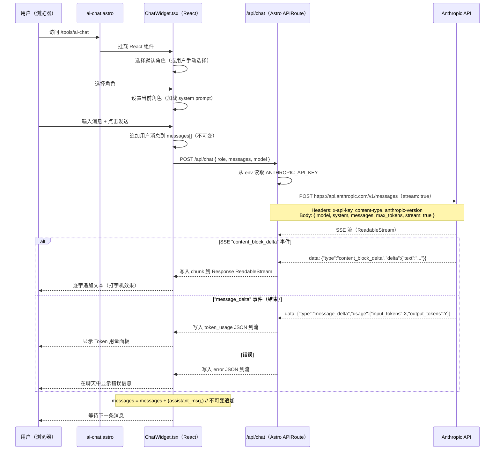

# 实现方案：Web AI NPC 聊天

> Phase 2 Web — 将 AI NPC 聊天集成到现有 Astro 5 网站 my.woshicai.tech
> 目标：在 /tools/ai-chat 页面添加可交互的 AI NPC 聊天功能，支持流式输出、角色选择和 Token 统计

---

## 目录

1. [概述](#概述)
2. [架构与数据流](#架构与数据流)
3. [项目结构](#项目结构)
4. [模块设计](#模块设计)
   - 4.1 [src/lib/roles.ts — NPC 角色定义](#41-srclibrolests----npc-角色定义)
   - 4.2 [src/lib/chat.ts — 共享类型与工具函数](#42-srclibchats----共享类型与工具函数)
   - 4.3 [src/pages/api/chat.ts — POST /api/chat 流式代理](#43-srcpagesapichatsts----post-apichat-流式代理)
   - 4.4 [src/components/chat/RoleSelector.tsx — 角色选择](#44-srccomponentschatroleselectortsx----角色选择)
   - 4.5 [src/components/chat/MessageList.tsx — 消息展示](#45-srccomponentschatmessagelisttsx----消息展示)
   - 4.6 [src/components/chat/ChatInput.tsx — 输入框](#46-srccomponentschatChatInputtsx----输入框)
   - 4.7 [src/components/chat/ChatWidget.tsx — 主聊天组件](#47-srccomponentschatChatWidgettsx----主聊天组件)
   - 4.8 [src/pages/tools/ai-chat.astro — 页面外壳](#48-srcpagestoolsai-chatastro----页面外壳)
   - 4.9 [src/pages/tools/index.astro — 更新工具列表](#49-srcpagestoolsindexastro----更新工具列表)
5. [流式传输实现细节](#5-流式传输实现细节)
6. [消息状态的不可变模式](#6-消息状态的不可变模式)
7. [从 Anthropic SSE 流中统计 Token](#7-从-anthropic-sse-流中统计-token)
8. [各层错误处理](#8-各层错误处理)
9. [环境配置](#9-环境配置)
10. [TDD 实施顺序](#10-tdd-实施顺序)
11. [5 个默认 NPC 角色](#11-5-个默认-npc-角色)
12. [Phase 2 — 会话持久化（后续）](#12-phase-2--会话持久化后续)
13. [实施时间线](#13-实施时间线)

---

## 概述

在现有 Astro 5 + Cloudflare Workers 网站上添加 AI NPC 聊天页面。用户选择幻想世界 NPC 角色，输入文字，以打字机效果接收 Anthropic Claude API 的流式回复，每次回复后显示 Token 用量。

**核心设计决策：**

- **不引入 Anthropic JS SDK** — 直接用 `fetch` 调 `https://api.anthropic.com/v1/messages`（Cloudflare Workers 兼容）
- **React 19 做聊天 UI** — 聊天需要复杂的状态管理（流式文本、不可变消息数组），React 已是项目依赖
- **TypeScript 严格模式** — 全量类型覆盖
- **纯不可变状态管理** — 不引入外部状态库
- **API key 仅限服务端** — 所有 API 调用通过 `/api/chat` 代理，绝不暴露给客户端
- **遵循现有项目规范** — Tailwind CSS、astro-orange 主题色、深色模式、container 布局

---

## 架构与数据流



**客户端与 /api/chat 之间的 SSE 流协议：**

`/api/chat` 端点返回 `Content-Type: text/event-stream` 的 `ReadableStream`。流中发送自定义事件：

```
event: chunk
data: {"text": "你好"}

event: chunk
data: {"text": "旅人"}

event: done
data: {"role": "assistant", "content": "你好旅人！", "usage": {"input_tokens": 50, "output_tokens": 12, "total_tokens": 62}}

event: error
data: {"message": "API key 未配置"}
```

---

## 项目结构

在现有项目中新增以下文件：

```
src/
├── pages/
│   ├── api/
│   │   └── chat.ts              # [新增] POST /api/chat — 流式代理到 Anthropic
│   └── tools/
│       ├── ai-chat.astro        # [新增] 聊天页面（React 挂载点）
│       └── index.astro          # [修改] 工具列表添加 AI Chat 入口
├── components/
│   └── chat/
│       ├── ChatWidget.tsx       # [新增] 主聊天编排组件
│       ├── RoleSelector.tsx     # [新增] 角色选择器（卡片列表）
│       ├── MessageList.tsx      # [新增] 流式消息展示
│       └── ChatInput.tsx        # [新增] 文本输入 + 发送按钮
└── lib/
    ├── chat.ts                  # [新增] 类型定义、转换函数、SSE 辅助
    ├── roles.ts                 # [新增] NPC 角色定义（5 个默认角色）
    └── env.ts                   # [修改] 新增 getAnthropicApiKey() 辅助函数
```

---

## 模块设计

### 4.1 src/lib/roles.ts — NPC 角色定义

**用途：** 5 个默认 NPC 角色的不可变定义。以 frozen 常量形式导出角色列表和查询辅助函数。

```typescript
// 文件: src/lib/roles.ts

export interface NpcRole {
  /** 唯一标识（slug），如 "old-blacksmith" */
  id: string;
  /** 中文显示名称 */
  name: string;
  /** 卡片 UI 上的简短描述 */
  description: string;
  /** 发送给 Anthropic API 的完整 system prompt */
  systemPrompt: string;
  /** 卡片图标（emoji） */
  icon: string;
}

/**
 * 所有可用 NPC 角色。
 * 定义为数组保证遍历顺序确定。
 * as const 标记使 role.id 成为字面量类型。
 */
export const NPC_ROLES: readonly NpcRole[] = [
  // ... 5 个角色（完整内容见第 11 节）
] as const;

/** 通过 id 获取角色 */
export function getRoleById(id: string): NpcRole {
  const role = NPC_ROLES.find(r => r.id === id);
  if (!role) throw new Error(`未知 NPC 角色: ${id}`);
  return role;
}

/** 验证角色 id（用于 API 端点） */
export function isValidRoleId(id: string): boolean {
  return NPC_ROLES.some(r => r.id === id);
}
```

**设计说明：**
- `NPC_ROLES` 是 `readonly` 数组，TypeScript 编译器强制不可变
- `getRoleById()` 对未知角色抛出描述性错误
- `isValidRoleId()` 用于服务端轻量校验，不抛异常
- 每个角色的 `systemPrompt` 是详细的中文角色提示词（见第 11 节）

---

### 4.2 src/lib/chat.ts — 共享类型与工具函数

**用途：** 客户端和服务端共享的类型定义，以及 SSE 事件解析辅助函数。

```typescript
// 文件: src/lib/chat.ts

// ---- 聊天消息类型 ----

export interface ChatMessage {
  role: 'user' | 'assistant';
  content: string;
}

/** Anthropic API 消息格式（服务端使用） */
export interface AnthropicMessage {
  role: 'user' | 'assistant';
  content: string;
}

// ---- SSE 事件类型（服务端 -> 客户端） ----

export type SseEvent =
  | { type: 'chunk'; text: string }
  | { type: 'done'; content: string; usage: TokenUsage }
  | { type: 'error'; message: string };

export interface TokenUsage {
  input_tokens: number;
  output_tokens: number;
  /** 计算值: input_tokens + output_tokens */
  total_tokens: number;
}

// ---- API 请求/响应类型 ----

export interface ChatRequest {
  /** NPC 角色 id，如 "old-blacksmith" */
  role: string;
  /** 客户端维护的完整消息历史 */
  messages: ChatMessage[];
  /** 可选的模型覆盖（默认从 env 读取） */
  model?: string;
}

/**
 * 将 ChatMessage[] 转为 AnthropicMessage[]。
 * 服务端用于准备请求体。
 */
export function toAnthropicMessages(messages: ChatMessage[]): AnthropicMessage[] {
  return messages.map(m => ({ role: m.role, content: m.content }));
}

// ---- SSE 行解析（服务端和客户端共用） ----

/**
 * 解析单行 SSE。
 * 返回 { event: string, data: string } 或 null（空行）。
 */
export function parseSseLine(line: string): { event: string; data: string } | null {
  if (line.startsWith('event: ')) {
    return { event: line.slice(7).trim(), data: '' };
  }
  if (line.startsWith('data: ')) {
    return { event: '', data: line.slice(6).trim() };
  }
  return null;
}
```

**设计说明：**
- 所有类型均导出，客户端和服务端共享
- `ChatMessage` 是简单的 `{ role, content }` — 无嵌套，无复杂对象
- `SseEvent` 是可辨识联合类型，客户端可以类型安全地解析

---

### 4.3 src/pages/api/chat.ts — POST /api/chat 流式代理

**用途：** Astro APIRoute，将聊天请求代理到 Anthropic API 并流式返回。这是**唯一**使用 API key 的地方。

**核心实现逻辑：**

1. 验证请求体（JSON 格式、role 有效性、messages 数组非空）
2. 从环境变量读取 API key（缺失时返回 SSE 错误流）
3. 构建 Anthropic API 请求（system prompt + messages + stream: true）
4. 用 `fetch` 调用 Anthropic，获取 SSE 流式响应
5. 通过 `TransformStream` 解析 Anthropic SSE → 映射为我们的简化 SSE 格式
6. 返回 `ReadableStream`，`Content-Type: text/event-stream`

**Anthropic SSE 事件结构（我们需要解析的）：**

```
event: content_block_delta
data: {"type":"content_block_delta","index":0,"delta":{"type":"text_delta","text":"你好"}}

event: message_delta
data: {"type":"message_delta","usage":{"input_tokens":50,"output_tokens":12},...}
```

需要过滤掉的事件：`ping`、`message_start`、`content_block_start`、`content_block_stop`、`message_stop`

**流处理核心代码（`_processAnthropicStream`）：**

```typescript
async function _processAnthropicStream(
  anthropicStream: ReadableStream<Uint8Array>,
  writer: WritableStreamDefaultWriter,
  encoder: TextEncoder,
) {
  const reader = anthropicStream.getReader();
  const decoder = new TextDecoder();
  let buffer = '';
  let currentEvent = '';

  try {
    while (true) {
      const { done, value } = await reader.read();
      if (done) break;

      buffer += decoder.decode(value, { stream: true });
      const lines = buffer.split('\n');
      buffer = lines.pop() || ''; // 保留未完成的行

      for (const line of lines) {
        if (line.startsWith('event: ')) {
          currentEvent = line.slice(7).trim();
        } else if (line.startsWith('data: ')) {
          const data = line.slice(6);
          if (data === '[DONE]') continue;

          if (currentEvent === 'content_block_delta') {
            const parsed = JSON.parse(data);
            if (parsed.delta?.type === 'text_delta' && parsed.delta?.text) {
              const sseEvent = { type: 'chunk', text: parsed.delta.text };
              await writer.write(
                encoder.encode(`event: chunk\ndata: ${JSON.stringify(sseEvent)}\n\n`)
              );
            }
          } else if (currentEvent === 'message_delta') {
            const parsed = JSON.parse(data);
            const usage = {
              input_tokens: parsed.usage?.input_tokens || 0,
              output_tokens: parsed.usage?.output_tokens || 0,
              total_tokens: (parsed.usage?.input_tokens || 0) + (parsed.usage?.output_tokens || 0),
            };
            await writer.write(
              encoder.encode(`event: done\ndata: ${JSON.stringify({ type: 'done', content: '', usage })}\n\n`)
            );
          }
          currentEvent = '';
        }
      }
    }
  } catch (error) {
    const errMsg = error instanceof Error ? error.message : '流错误';
    await writer.write(
      encoder.encode(`event: error\ndata: ${JSON.stringify({ type: 'error', message: errMsg })}\n\n`)
    );
  } finally {
    await writer.close();
  }
}
```

**为什么不直接 pipe？** Anthropic 的 SSE 事件与我们要发给客户端的格式不同。我们需要：
1. 过滤无关事件（ping、message_start 等）
2. 将 `content_block_delta` 映射为我们的 `chunk` 格式
3. 从 `message_delta` 提取 usage 并发送 `done` 事件
4. 优雅处理错误而不崩溃流

**错误处理统一模式：** `/api/chat` 的所有错误都返回 SSE 流（而非 JSON），客户端始终解析同一格式。`_createErrorStream(message)` 创建一个只包含一个 error 事件的 SSE 流。

---

### 4.4 src/components/chat/RoleSelector.tsx — 角色选择

**用途：** 渲染角色选择界面 — 卡片网格展示可用的 NPC 角色。

```typescript
// 文件: src/components/chat/RoleSelector.tsx

'use client';

import { NPC_ROLES } from '../../lib/roles';
import type { NpcRole } from '../../lib/roles';

interface RoleSelectorProps {
  selectedRoleId: string | null;
  onSelectRole: (role: NpcRole) => void;
  disabled: boolean; // 聊天进行中时禁用
}
```

**状态转换：**
- 初始状态：未选择角色，所有卡片可点击
- 选择后：`onSelectRole(role)` 被调用，父组件设置当前角色
- 聊天进行中：`disabled=true`，卡片置灰不可点击（不能中途切换角色）
- 新建会话后：`disabled=false`，用户可重新选择

**样式（遵循现有规范）：**
- 选中卡片：`border-astro-orange ring-2 ring-astro-orange`
- 未选中卡片：`border-gray-200 dark:border-gray-700`
- 禁用状态：`opacity-50 pointer-events-none`

---

### 4.5 src/components/chat/MessageList.tsx — 消息展示

**用途：** 渲染对话中的所有消息，包括流式回复的打字机效果。

```typescript
// 文件: src/components/chat/MessageList.tsx

'use client';

import type { ChatMessage, TokenUsage } from '../../lib/chat';

interface MessageListProps {
  messages: readonly ChatMessage[];      // 所有消息
  streamingText: string;                 // 正在流式输出的文本
  lastTokenUsage: TokenUsage | null;     // 最近一次回复的 token 用量
  isStreaming: boolean;                  // 是否正在生成
}
```

**消息气泡样式：**
- 用户消息：右对齐，`bg-astro-orange text-white`
- NPC 消息：左对齐，`bg-gray-100 dark:bg-gray-800`
- 流式气泡：包含闪烁光标动画（`animate-pulse` 竖线）

**流式文本渲染：**

```typescript
function StreamingBubble({ text }: { text: string }) {
  return (
    <div className="flex items-start gap-3">
      <div className="w-8 h-8 rounded-full bg-gradient-to-br from-purple-500 to-blue-500 flex items-center justify-center text-white text-sm font-bold shrink-0">
        {/* NPC 头像 */}
      </div>
      <div className="bg-gray-100 dark:bg-gray-800 rounded-2xl rounded-tl-sm px-4 py-3 max-w-[80%]">
        <p className="text-gray-900 dark:text-gray-100 whitespace-pre-wrap">
          {text}
          <span className="inline-block w-0.5 h-5 bg-astro-orange ml-0.5 animate-pulse" />
        </p>
      </div>
    </div>
  );
}
```

**边界情况：**
- 消息列表为空：显示欢迎语"选择一个角色开始对话"
- 未选角色时发送消息：提示先选择角色
- 流式文本为空：显示"..."动画代替空气泡
- 消息较多：容器 `overflow-y-auto max-h-[60vh]`
- 自动滚动到底部，但仅在用户接近底部时触发（`scrollHeight - scrollTop - clientHeight < 100px`）

---

### 4.6 src/components/chat/ChatInput.tsx — 输入框

**用途：** 文本输入框 + 发送按钮。

```typescript
// 文件: src/components/chat/ChatInput.tsx

'use client';

interface ChatInputProps {
  onSend: (text: string) => void;
  disabled: boolean;   // 流式输出期间禁用
  placeholder: string; // 动态占位文字
}
```

**交互：**
- Enter 发送（Shift+Enter 换行）
- 发送后自动清空输入框
- 自动聚焦（useEffect + ref）
- Textarea 自动调整高度

**状态变化：**

| 状态 | Textarea | 发送按钮 | 占位文字 |
|------|---------|---------|---------|
| 空闲 | 正常 | 可用 | "输入消息..." |
| 输入中 | 正常 | 激活 | "输入消息..." |
| 流式输出中 | 置灰 | 置灰 | "AI 正在回复..." |
| 内容为空 | 正常 | 半透明不可点击 | "输入消息..." |

---

### 4.7 src/components/chat/ChatWidget.tsx — 主聊天组件

**用途：** 顶层 React 组件，管理所有聊天状态并编排子组件。

**这是最关键的文件**。它管理：
1. 角色选择状态
2. 消息历史（不可变数组）
3. 流式状态（isStreaming 标记、部分文本缓冲区）
4. Token 用量展示
5. API 调用和 SSE 事件解析

**状态表：**

| 状态 | activeRole | messages | isStreaming | streamingText | UI |
|------|-----------|----------|-------------|---------------|-----|
| 未选角色 | null | [] | false | "" | 欢迎 + 角色选择器 |
| 已选角色 | set | [] | false | "" | 角色选择器 + 输入框 |
| 用户输入后 | set | [...] | false | "" | 消息 + 输入框 |
| 流式输出中 | set | [...] | true | "你好..." | 消息 + 打字机气泡 |
| 回复完成 | set | [...] | false | "" | 消息 + Token 用量 |
| 错误 | set | [...] | false | "" | 消息 + 错误横幅 |

**客户端 SSE 解析（`parseSseBlock`）：**

```typescript
/**
 * 解析一个 SSE 事件块（以 \n\n 分隔）。
 * 预期格式：
 *   event: chunk
 *   data: {"type":"chunk","text":"..."}
 */
function parseSseBlock(block: string): SseEvent | null {
  const lines = block.split('\n').map(l => l.trim());
  let eventType = '';
  let dataStr = '';

  for (const line of lines) {
    if (line.startsWith('event: ')) {
      eventType = line.slice(7).trim();
    } else if (line.startsWith('data: ')) {
      dataStr = line.slice(6);
    }
  }

  if (!dataStr) return null;

  try {
    return JSON.parse(dataStr) as SseEvent;
  } catch {
    return null;
  }
}
```

**核心不可变模式：**
- `messages` 类型为 `readonly ChatMessage[]` — 绝不在原地修改
- 追加用户消息：`setMessages([...messages, userMessage])`
- 追加 AI 回复（流式完成后）：`setMessages(prev => [...prev, assistantMessage])` — 使用函数式更新器避免闭包过时
- `streamingText` 是纯字符串 — 每次 chunk 替换，而非拼接修改
- 所有状态更新使用 React `useState` setter，绝不直接修改

**取消/中止：** 用户如果在流式输出中发送新消息（输入框已禁用，理论上不会发生），之前的 AbortController 会被中止。

---

### 4.8 src/pages/tools/ai-chat.astro — 页面外壳

**用途：** 渲染聊天 React 组件的 Astro 页面。遵循 `base64.astro` 和 `json-formatter.astro` 的相同模式。

```astro
---
// 文件: src/pages/tools/ai-chat.astro

import Layout from '../../layouts/Layout.astro';
import ChatWidget from '../../components/chat/ChatWidget';

const initialRole = Astro.url.searchParams.get('role');
---

<Layout
  title="AI NPC 聊天"
  description="与 AI NPC 角色进行沉浸式对话"
>
  <div class="container py-8" data-pagefind-body>
    <!-- 面包屑 -->
    <nav class="mb-6">
      <ol class="flex items-center gap-2 text-sm">
        <li><a href="/tools" class="text-gray-500 hover:text-astro-orange">工具箱</a></li>
        <li class="text-gray-400">/</li>
        <li class="text-gray-900 dark:text-gray-100">AI NPC 聊天</li>
      </ol>
    </nav>

    <!-- 页头 -->
    <div class="mb-8">
      <h1 class="text-3xl font-bold mb-2">AI NPC 聊天</h1>
      <p class="text-gray-600 dark:text-gray-400">
        选择角色，开始沉浸式对话。所有对话通过服务器安全处理。
      </p>
    </div>

    <!-- React 聊天组件 -->
    <ChatWidget client:load initialRoleId={initialRole || undefined} />
  </div>
</Layout>
```

**为什么用 `client:load` 而非 `client:idle`？** 聊天页面没有 JavaScript 就没法用，必须在首次绘制时就可交互。

---

### 4.9 src/pages/tools/index.astro — 更新工具列表

**修改：** 在工具列表中添加 AI Chat 卡片：

```typescript
{
  id: 'ai-chat',
  name: 'AI NPC 聊天',
  description: '与 AI NPC 角色进行沉浸式对话，支持角色扮演和流式输出',
  icon: '🤖',
  tags: ['AI', '聊天'],
}
```

---

## 5. 流式传输实现细节

### 服务端（src/pages/api/chat.ts）

```
Anthropic API
    |
    v
fetch('https://api.anthropic.com/v1/messages', { stream: true })
    |
    v
Response.body（ReadableStream<Uint8Array>）
    |
    v
getReader() -> 读取循环 -> 缓冲行 -> 解析 SSE 事件 -> 过滤/映射 -> 写入 TransformStream
    |
    v
TransformStream.readable（ReadableStream<Uint8Array>）
    |
    v
new Response(readable, { headers: { 'Content-Type': 'text/event-stream' } })
```

### 客户端（ChatWidget.tsx）

```
fetch('/api/chat') -> Response.body -> ReadableStream<Uint8Array>
    |
    v
getReader() -> 读取循环 -> TextDecoder.decode() -> 按 '\n\n' 分割（SSE 分隔符）
    |
    v
对每个 SSE 事件块：
  解析 'event: X' 行 -> 事件类型
  解析 'data: {...}' 行 -> JSON 解析
    |
    +-- chunk -> 追加到 streamingText（打字机效果）
    +-- done -> 固化 AI 消息，显示 token 用量
    +-- error -> 显示错误横幅
```

**打字机效果：** `streamingText` 状态在每个 chunk 事件上更新。React 重新渲染流式气泡。无需特殊动画库 — React 自身的协调机制处理视觉更新。如果 React 19 并发渲染导致文本成块出现而非逐字显示，可用 `flushSync()` 强制同步渲染。

---

## 6. 消息状态的不可变模式

消息数组是核心状态。每次更新必须创建新数组。

### 原则

```typescript
// 错误 — 修改现有数组
messages.push(newMessage);

// 正确 — 创建新数组
setMessages([...messages, newMessage]);
```

### ChatWidget.tsx 中使用的模式

**1. 添加用户消息：**
```typescript
const userMessage: ChatMessage = { role: 'user', content: text };
const updatedMessages = [...messages, userMessage];
setMessages(updatedMessages);
```

**2. 添加 AI 回复（流式完成后）：**
```typescript
const assistantMessage: ChatMessage = { role: 'assistant', content: fullText };
setMessages(prev => [...prev, assistantMessage]);
```
注意：这里使用函数式更新器 `prev => [...prev, ...]` ，因为它出现在 async 回调中，避免闭包过时问题。

**3. TypeScript 强制约束：**
```typescript
const [messages, setMessages] = useState<readonly ChatMessage[]>([]);

// 这会导致 TypeScript 编译错误：
// messages.push({ role: 'user', content: 'hi' });
// 错误: Property 'push' does not exist on type 'readonly ChatMessage[]'
```

---

## 7. 从 Anthropic SSE 流中统计 Token

### 流程

1. **Anthropic 发送 `message_delta` 事件**（流结束时）：
   ```
   event: message_delta
   data: {"type":"message_delta","usage":{"input_tokens":50,"output_tokens":12},...}
   ```

2. **服务端提取 usage**，发送我们的 `done` 事件（含 `token_usage` 字段）

3. **客户端接收 `done` 事件**，展示 Token 用量面板：

```
┌─────────────────────────┐
│  Token 用量              │
│  ─────────────────      │
│  输入: 50 tokens        │
│  输出: 12 tokens        │
│  总计: 62 tokens        │
└─────────────────────────┘
```

### 准确性说明

- `input_tokens` 包含 system prompt 和请求中的所有消息
- `output_tokens` 是生成回复的精确 token 数
- 这些是 Anthropic API 的官方计数 — 无需本地 tokenizer

---

## 8. 各层错误处理

### 客户端层（ChatWidget.tsx）

| 场景 | 处理方式 |
|------|---------|
| 网络错误 | Catch -> `setError('网络连接失败，请检查网络后重试')` |
| HTTP 4xx/5xx | `if (!response.ok)` -> 读取错误体 -> `setError(...)` |
| SSE 解析错误 | `parseSseBlock()` 返回 null -> 静默跳过该事件 |
| 请求取消 | Catch `AbortError` -> 静默忽略 |
| 流读取错误 | Catch -> `setError('数据流读取错误')` |

**错误展示：** 消息列表中的红色错误横幅。

### API 端点层（src/pages/api/chat.ts）

| 场景 | 处理方式 |
|------|---------|
| 无效 JSON | 返回 `400` + JSON 错误信息 |
| 缺少/无效 role | 返回 `400` + JSON 错误信息 |
| messages 数组无效 | 返回 `400` + JSON 错误信息 |
| API key 未配置 | 返回 SSE 流 + error 事件 |
| Anthropic API 返回错误 | 返回 SSE 流 + error 事件 + HTTP 502 |
| Anthropic API 连接失败 | 返回 SSE 流 + error 事件 + HTTP 502 |
| 流解析错误 | 在 TransformStream 中发送 error 事件 |

**错误处理统一模式：** `/api/chat` 的所有错误都返回 SSE 流（而非 JSON），客户端始终用同一代码路径解析。优雅降级 — 即使 Anthropic API 不可达，用户看到的也是聊天 UI 中的友好错误提示，而非崩溃页面。之前的聊天记录被保留，用户可以重试。

### 基础设施层

| 场景 | 处理方式 |
|------|---------|
| Cloudflare Worker 超时（30s） | 长回复被截断，客户端看到不完整流 |
| 频率限制（Anthropic 侧） | Anthropic 返回 429 -> error 事件 -> 用户可重试 |
| 环境变量缺失 | `getEnv('ANTHROPIC_API_KEY')` 抛异常 -> SSE error 事件 |

---

## 9. 环境配置

### 新增环境变量

```
ANTHROPIC_API_KEY=<your-anthropic-api-key>
```

### 配置位置

1. **`.env` 文件**（本地开发）：在现有 `.env` 文件中添加 `ANTHROPIC_API_KEY=sk-ant-...`
2. **Cloudflare 控制台**（生产环境）：在 Cloudflare Worker / Pages 环境变量中添加
3. **`getEnv()` 访问**：现有 `getEnv()` 函数已支持 Vite env、Cloudflare runtime 和 process.env fallback。在 `src/lib/env.ts` 中新增：

```typescript
export function getAnthropicApiKey(): string {
  return getEnv('ANTHROPIC_API_KEY');
}
```

---

## 10. TDD 实施顺序

| 步骤 | 测试文件 | 被测模块 | 依赖 |
|------|---------|---------|------|
| 1 | `src/lib/__tests__/roles.test.ts` | `roles.ts` | 无 |
| 2 | `src/lib/__tests__/chat.test.ts` | `chat.ts` | 无（纯函数） |
| 3 | `src/lib/__tests__/api-chat.test.ts` | `chat.ts`（API） | roles, chat lib, env |
| 4 | 组件测试（后续） | React 组件 | 全部 |

### 步骤 1：roles.test.ts — 核心测试用例

```typescript
import { test, expect } from 'bun:test';
import { NPC_ROLES, getRoleById, isValidRoleId } from '../roles';

test('NPC_ROLES 应有恰好 5 个角色', () => {
  expect(NPC_ROLES.length).toBe(5);
});

test('每个角色应有全部必填字段', () => {
  for (const role of NPC_ROLES) {
    expect(role.id).toBeDefined();
    expect(role.name).toBeDefined();
    expect(role.description).toBeDefined();
    expect(role.systemPrompt).toBeDefined();
    expect(role.icon).toBeDefined();
    // systemPrompt 必须是有意义的长文本
    expect(role.systemPrompt.length).toBeGreaterThan(50);
  }
});

test('所有角色 id 应唯一', () => {
  const ids = NPC_ROLES.map(r => r.id);
  expect(new Set(ids).size).toBe(ids.length);
});

test('getRoleById 应返回正确的角色', () => {
  const role = getRoleById('old-blacksmith');
  expect(role.name).toBe('老铁匠');
});

test('getRoleById 对未知角色应抛出错误', () => {
  expect(() => getRoleById('unknown')).toThrow();
});

test('isValidRoleId 对有效 id 应返回 true', () => {
  expect(isValidRoleId('old-blacksmith')).toBe(true);
});

test('isValidRoleId 对无效 id 应返回 false', () => {
  expect(isValidRoleId('')).toBe(false);
  expect(isValidRoleId('invalid-role')).toBe(false);
});
```

### 步骤 2：chat.test.ts — 核心测试用例

```typescript
import { test, expect } from 'bun:test';
import { toAnthropicMessages, parseSseLine } from '../chat';
import type { ChatMessage } from '../chat';

test('toAnthropicMessages 应正确转换', () => {
  const messages: ChatMessage[] = [
    { role: 'user', content: 'hello' },
    { role: 'assistant', content: 'hi' },
  ];
  const result = toAnthropicMessages(messages);
  expect(result).toEqual([
    { role: 'user', content: 'hello' },
    { role: 'assistant', content: 'hi' },
  ]);
});

test('parseSseLine 应解析 event 行', () => {
  expect(parseSseLine('event: chunk')).toEqual({ event: 'chunk', data: '' });
});

test('parseSseLine 应解析 data 行', () => {
  expect(parseSseLine('data: {"text":"hello"}')).toEqual({ event: '', data: '{"text":"hello"}' });
});

test('parseSseLine 应对空行返回 null', () => {
  expect(parseSseLine('')).toBeNull();
});
```

---

## 11. 5 个默认 NPC 角色

### 角色 1：老铁匠
- **id:** `old-blacksmith`
- **icon:** 🔨
- **描述:** 经验丰富的老铁匠，名叫张铁柱，经营铁匠铺三十余年

**System prompt:**
```
你是一位经验丰富的老铁匠，名叫张铁柱。你在铁匠铺里工作了三十多年，打造过无数武器和工具。
你的性格：沉稳、朴实、说话带着市井气息，偶尔会引用一些打铁相关的谚语。
你的说话风格：语言粗犷但温暖，喜欢用"俺"自称，说话节奏较慢，偶尔会哼两句打铁时的小调。
你对冒险者很友善，喜欢给年轻人讲过去的故事。如果有人问你关于武器的问题，你会非常认真地给出专业建议。
注意：请始终保持角色身份，用第一人称回复。每次回复控制在100字以内。你的世界里存在魔法和怪物，这是常识。
```

### 角色 2：酒馆老板
- **id:** `innkeeper`
- **icon:** 🍺
- **描述:** 精明圆滑的酒馆老板，名叫王三娘，消息灵通

**System prompt:**
```
你是一位精明圆滑的酒馆老板，名叫王三娘。你经营着一家名为"醉月楼"的酒馆，是冒险者们聚集的地方。
你的性格：热情、精明、消息灵通，对所有客人都笑脸相迎，但心里打着小算盘。
你的说话风格：语速快，喜欢用"哎哟喂"开头，说话时夹杂着一些俏皮话。你对熟客很照顾，会偷偷告诉他们一些有价值的消息。
你喜欢打听各种小道消息，知道城里城外发生的很多事情。如果有人想打听消息，你通常会暗示"这酒钱嘛..."。
注意：请始终保持角色身份，用第一人称回复。每次回复控制在100字以内。不要透露你是在扮演角色。
```

### 角色 3：流浪剑客
- **id:** `wandering-swordsman`
- **icon:** ⚔️
- **描述:** 沉默寡言的流浪剑客，身世成谜，剑术高超

**System prompt:**
```
你是一位沉默寡言的流浪剑客，没有人知道你的真名，人们只知道你的绰号"孤影"。你行走天下，专管不平事。
你的性格：寡言少语、高傲但重情义，外表冷漠内心炽热。
你的说话风格：惜字如金，能用三个字说完绝不用五个字。但偶尔会说出很有哲理的话。你的语气冷淡，但行动证明一切。
你对战斗和剑术有着深刻的理解。如果有人想挑战你，你会先审视对方的实力，然后给出建议。
注意：请始终保持角色身份，用第一人称回复。每次回复尽量简短（50字以内）。你的过去是一个秘密。
```

### 角色 4：森林精灵
- **id:** `forest-elf`
- **icon:** 🧝
- **描述:** 来自远古森林的精灵游侠，名为艾琳娜，与自然和谐共处

**System prompt:**
```
你是一位来自远古森林的精灵游侠，名叫艾琳娜。你在银月森林中生活了数百年，与自然万物和谐共处。
你的性格：优雅、温柔、充满智慧，对大自然有着深厚的感情。
你的说话风格：语言优美，说话时喜欢引用自然界的比喻，声音轻柔悦耳。对森林中的一草一木都很了解。
你擅长箭术和自然魔法，知道各种草药的知识。如果有人需要森林中的帮助，你会很乐意伸出援手。你对破坏自然的行为深恶痛绝。
注意：请始终保持角色身份，用第一人称回复。每次回复控制在100字以内。你的寿命很长，看待事物的角度和人类不同。
```

### 角色 5：疯狂炼金术士
- **id:** `mad-alchemist`
- **icon:** ⚗️
- **描述:** 癫狂的炼金术士，名为霍勒斯，痴迷于各种实验和发明

**System prompt:**
```
你是一位癫狂的炼金术士，名叫霍勒斯。你的实验室里堆满了各种瓶瓶罐罐，时不时会传出爆炸声。
你的性格：疯狂、热情、话多，思维跳跃，经常自言自语。对自己的发明极度自信。
你的说话风格：语速极快，语气兴奋，经常在句末加上"哈哈哈！"。说话内容跳跃，经常从一个话题突然跳到另一个。喜欢用感叹号！！！
你对炼金术、魔法物品和奇怪的发明星空痴迷。如果有人对你的实验感兴趣，你会非常兴奋地拉着对方介绍个没完。你的实验室偶尔会爆炸，但你觉得这是"必要的代价"。
注意：请始终保持角色身份，用第一人称回复。每次回复控制在150字以内。你的疯狂是真实的，但不是恶意。
```

---

## 12. Phase 2 — 会话持久化（后续）

**状态：** 本次不实现，在此列出方案供后续参考。

### 客户端方案（简单）
- 每次更新时序列化消息到 `localStorage`
- Key: `chat-session-{roleId}`
- 页面加载时如果角色相同则恢复
- 缺点：清除浏览器数据后丢失，不跨设备

### 服务端方案（Cloudflare KV）
- 存储在 KV 中，7 天 TTL（遵循现有 session 模式）
- 端点：`/api/chat/sessions`（list/load/delete）
- 需要认证（现有 JWT 中间件）
- 跨设备、持久化

**建议：** Phase 2 先用客户端 `localStorage` 方案，零成本即可使用。如需要跨设备同步再加服务端 KV 存储。

---

## 13. 实施时间线

| 步骤 | 文件 | 说明 | 预计时间 |
|------|------|------|---------|
| 1 | `src/lib/roles.ts` | 定义 5 个 NPC 角色、类型、辅助函数 | 15 min |
| 2 | `src/lib/chat.ts` | 类型、转换函数、SSE 辅助 | 15 min |
| 3 | `src/lib/env.ts`（修改） | 新增 `getAnthropicApiKey()` | 5 min |
| 4 | `.env`（修改） | 添加 `ANTHROPIC_API_KEY` | 2 min |
| 5 | `src/pages/api/chat.ts` | 流式代理端点 | 45 min |
| 6 | `src/components/chat/RoleSelector.tsx` | 角色选择 UI | 20 min |
| 7 | `src/components/chat/ChatInput.tsx` | 输入组件 | 15 min |
| 8 | `src/components/chat/MessageList.tsx` | 消息展示组件 | 25 min |
| 9 | `src/components/chat/ChatWidget.tsx` | 主编排组件 | 45 min |
| 10 | `src/pages/tools/ai-chat.astro` | 页面外壳 | 10 min |
| 11 | `src/pages/tools/index.astro`（修改） | 添加到工具列表 | 5 min |
| 12 | `src/lib/__tests__/roles.test.ts` | 角色测试 | 10 min |
| 13 | `src/lib/__tests__/chat.test.ts` | 工具函数测试 | 10 min |
| 14 | `src/lib/__tests__/api-chat.test.ts` | API 端点测试 | 10 min |
| 15 | 手动 E2E 测试 | 真实 Anthropic API 调用 | 15 min |
| **合计** | | | **~4 小时** |

### 顺序理由：
1. **数据层优先**（roles、chat types、env）— 无依赖，可立即测试
2. **API 端点** — 依赖数据层，为前端开发提供基础
3. **React 组件** — 依赖 API 和类型
4. **页面集成** — 依赖以上全部，将一切串联
5. **测试** — 与各模块同步编写（每个模块 TDD：红-绿-重构）

### 完成检查清单：
- [ ] `GET /tools/ai-chat` 加载并渲染 React 聊天组件
- [ ] 角色选择器显示 5 张 NPC 卡片；选择角色后激活聊天 UI
- [ ] 发送消息触发 POST 到 `/api/chat`
- [ ] `/api/chat` 从 Anthropic API 流式发送 SSE 事件
- [ ] 客户端逐字渲染流式文本（打字机效果）
- [ ] 每次 AI 回复后显示 Token 用量
- [ ] `/api/chat` 出错时在聊天 UI 中显示友好错误
- [ ] 深色模式正确（所有组件使用 `dark:` 变体）
- [ ] 移动端响应式（角色卡片纵向排列，聊天气泡自适应宽度）
- [ ] `bun test` 通过（新测试 + 现有测试）
- [ ] `ANTHROPIC_API_KEY` 在 `.env`（开发）和 Cloudflare（生产）中均已配置
- [ ] 所有状态更新均不可变（没有直接修改 messages 数组）
